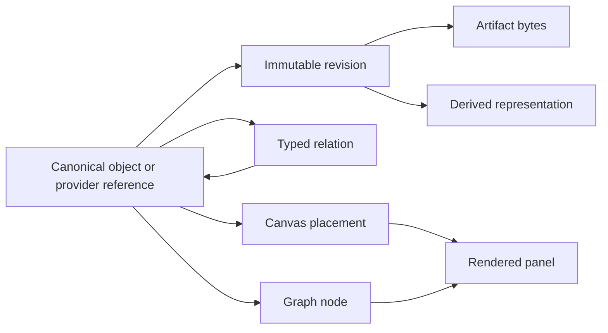

# Galaxy Brain v2: Living Research Atlas

## Product requirements and atomic implementation roadmap

**Status:** Active implementation contract and review ledger

**Date:** 2026-09-29

**Default-branch baseline:** `MonumentalSystems/GalaxyBrain` main at `94f95b61a14824d10d66a9a9182cf640b23c64da`

**Active v2 review slices:** PRs #204–#308 (not merged or deployed)

**Transitive landing chain:** 166 open dependent PRs, rooted at #140 and ending at #308 at the 2026-09-29 checkpoint

**Purpose:** Finish the UI and architecture overhaul without preserving the legacy component sprawl.

---

## 1. Executive decision

Galaxy Brain becomes a canvas-first, versioned research atlas over canonical objects.

The foundational primitive is a durable **object reference**, not a React component, graph node, card, or panel. The same object may be projected as a graph node, placed on a canvas, rendered as a paper reader, exported as Markdown, or composed into a Generous surface. A panel is only a view of an object at a particular place and scale.



The product should feel like one calm infinite surface with progressive disclosure, not a dashboard that opens many competing component systems. Canvas, graph, record, PDF, Markdown, ELN, proof, task, and Generous views are projections over shared identity and revision history.

### The short product thesis

- **Galaxy owns durable research objects, artifacts, revisions, placements, assertions, and the immutable proof DAG.**
- **HAM owns memory retrieval and live task/run coordination.**
- **Hyades owns execution and returns verification receipts.**
- **Rosetta owns accepted formal knowledge and correspondence.**
- **Prove2Me interoperates through import/export and remote identifiers; Galaxy must retain the graph if Prove2Me is unavailable.**
- **Generous supplies bounded generative presentation through `gb.surface.v1`; it does not become Galaxy’s object store or shell.**
- **Plugins add features. Connectors are optional configured instances used only by plugins that need an external service.**
- **Nostr is the shared external identity seam. No additional Galaxy identity product is required.**

---

## 2. Desired product experience

### Default entry

Opening a project or workspace lands on a full-viewport infinite canvas, not a dark-blue field card, dashboard, list, or receipt-like record. The global top rail remains small and stable. Contextual tools appear near the selection and may be pinned.

The user can:

1. Drop or import any supported media.
2. See a titled object placed on the canvas immediately.
3. Zoom from corpus/project density to cards, documents, passages, equations, and exact anchored regions.
4. Switch lenses without changing the underlying object:
   - **Atlas:** spatial arrangement and mixed media.
   - **Graph:** structure, dependencies, branches, conversation trees, proof DAGs.
   - **Read:** PDF, HTML, Markdown, media, or code detail.
   - **Verify:** evidence, challenge, provenance, receipts, contradictions.
   - **Compose:** branch, compare, synthesize, group, and publish.
5. Select text, a figure, an equation, a page region, an audio interval, or a code range and turn it into an anchored note, relation, task, or agent request.
6. Ask an agent to operate on the selected bounded context without granting it authority over unrelated data.

### Semantic zoom

Zoom is semantic, not merely optical:

| Scale | Primary representation |
| --- | --- |
| Corpus | density, constellations, project regions, health/frontier summaries |
| Project/campaign | clusters, milestones, task/proof regions, time bands |
| Task/run/chat | branch trees, dependencies, artifacts, claim/run state |
| Object | paper, experiment, task, theorem, note, media, surface |
| Region/atomic | excerpt, equation, figure, source line, metric, anchored claim |

The renderer must aggregate and substitute representations at scale. It must not mount one DOM panel per atomic object.

### Visual language and preserved reference fixtures

Two existing prototypes are explicit design inputs, not disposable demos:

- `snapshots/2026-09-10-later-previews/task-constructor-preview.html` is the interaction reference for focused task construction: a legible goal/context area, atomic jobs, dependencies, configuration/inspection, version-aware save, preview, and dispatch. Rebuild it through the task plugin and shared object/graph seams rather than restoring the Flowise modal or copying the archived HTML.
- `galaxy-brain-semantic-zoom.html` is the interaction reference for multi-scale navigation: aperture/lens controls, constellation-to-object transitions, progressive labeling, contextual inspection, and the sense that graph structure becomes navigable terrain. Preserve that spatial behavior, not its old dark-navy palette.

The default visual system uses the new living-scholarly-field theme across Canvas, Graph, Task Constructor, ELN, Papers, and inspectors:

- research paper `#F9F6F1` for primary surfaces;
- field sage `#6D7A68` and forest ink `#1E2A24` for structure and verified/core state;
- ochre `#C79A4B` for attention/frontier state;
- terracotta `#B66238` for conflict, rejection, or challenge;
- dusty indigo `#4E5A8C` for agent/task activity and secondary semantic paths;
- archive tan `#D8C8A6` for muted regions and provenance surfaces;
- Alegreya/Alegreya Sans for scholarly hierarchy and interface text, with JetBrains Mono for code, identifiers, receipts, and provenance.

Colors are semantic tokens with contrast-tested light and optional dark mappings; plugins consume the tokens and may not ship isolated product palettes. Paper texture and botanical/cartographic ornament remain subtle framing, never content-obscuring decoration.

---

## 3. Explicit non-goals and removals

Galaxy Brain will not preserve legacy UI merely because it exists.

### Remove from the product shell

- Global chat panel and chat overlay.
- Global tool panel.
- Social dashboard, feeds, accounts, and social connector work.
- Flowise-derived workflow editor as a general-purpose modal.
- Duplicate hand-built production pan/zoom implementations after Atlas parity.
- Browser-configurable provider URLs, arbitrary proxies, and browser-stored provider secrets.
- A second Galaxy role/identity hierarchy layered over Nostr.

Conversations remain useful, but become versioned objects rendered as a tree/branch graph or opened in context. Workflows remain useful, but become task plans or plugin-contributed constructors rather than preserving the Flowise product surface.

### Keep and consolidate

- PDF and paper reader.
- Markdown with KaTeX and source-safe HTML handling.
- ELN records and evidence drawer.
- Task constructor and proof campaign graph.
- Existing lightweight code editor; do not add Jupyter until a kernel-backed scientific workflow actually requires it.
- Voice input and captured audio artifacts.
- `gb.surface.v1` and the safe Generous renderer.
- Version histories, canonical references, artifacts, provenance, and Markdown export.

---

## 4. Current implementation baseline

### Confirmed on the default-branch baseline

- PR #133: `gb.canvas.snapshot.v1`, immutable canvas revisions, tenant-scoped canvas placement persistence, optimistic writes, Atlas placement persistence.
- PR #134: canonical HAM memory workspace, supersession lineage, HAM relations, federated graph projection, object-reference resolution.
- PR #135 and #137: generic Nostr-backed `/connect` authorization flow and simplified same-tenant connection behavior.
- PR #136: shared top rail and paper reader reorganized around the document.
- Existing proof DAG, proof-work overlay, paper workbench, ELN, task constructor, surface store, object-link ledger, Markdown/KaTeX renderer, ingestion transform preview, plugin proxy, and canvas-harness adapter.

### Implemented in the open atomic stack

The active stack is reviewable implementation evidence, not deployed-product
evidence. PRs #204–#308 remain open and must land in order because each child
uses the preceding feature branch as its base. The v2 slices sit on a longer
open transitive chain rooted at PR #140, so landing must begin there rather
than retargeting the v2 tail directly to `main`.

| PR | Delivered slice |
| --- | --- |
| #204 | Bounded server-owned Docling runtime. |
| #205 | Review-only Task Constructor proposals. |
| #206 | Authorized HAM relation overlays in Atlas. |
| #207 | Durable Atlas local-file import and placement. |
| #208 | Exact text, Markdown, and code document detail. |
| #209 | Safe raster-image originals and rendering. |
| #210 | Durable ELN document attachments. |
| #211 | Exact paper evidence handoff to Task Constructor. |
| #212 | Bounded corpus graph windows. |
| #213 | Agent-created, reviewable Generous surface drafts. |
| #214 | Exact profiled WebM/Opus audio originals. |
| #215 | Review-first browser voice recording. |
| #216 | Human confirmation and exact-revision surface promotion. |
| #217 | One shared graph shell rail plus updated implementation/retirement truth. |
| #218 | Private legacy-paper bytes bridged into one immutable durable document revision. |
| #219 | Exact pinned paper and document revisions projected as one `corresponds_to` graph relation. |
| #220 | Deterministic representation chunks, append-only completion manifests, and metadata-only local-index status. |
| #221 | Exact manifest implementation IDs resolved through a code-owned, allowlisted, format-aware Docling, MarkItDown, and plain-text adapter contract with version-bound replay identity. |
| #222 | Strict, hash-bound `rosetta.formal-project-package.v1` validation that keeps the raw Rosetta authored DAG, its versioned passive Galaxy repository-field projection, and correspondence distinct without mission or verification-state promotion. |
| #223 | Outcome-correct proof receipt presentation plus semantic-scale synchronization for later graph deep links, without turning local scale controls into a feedback loop. |
| #224 | Authenticated exact-byte formal-project package import, atomically registering compact immutable artifacts and one passive repository-field graph under tenant RLS without creating missions, work, provider state, verification, or publication state. |
| #225 | Prove2Me interoperability without authority conflation: immutable Galaxy DAG bytes retain only stable remote theorem IDs, while mutable provider status stays exclusively in the proof-work overlay and cannot imply mapping, verification, or activation. |
| #226 | Review-first browser import for the four-file formal-project package, with Worker-based validation, exact-envelope Nostr signing, strict response/hash binding, bounded errors, partial-success recovery, and passive graph selection that preserves newer navigation. |
| #227 | Atlas Tasks-plugin entry for the same formal-project-package importer, placing only the server-returned hash-pinned passive proof graph with registration-ID idempotency, original-canvas binding, and placement-only recovery after a committed import. |
| #228 | Exact pinned documents, document anchors, and their authorized paper/document links hydrated through the common projection gateway for Graph and Field; missing endpoints remain omitted, provider truncation stays visible, chunks never become graph objects, and Atlas placement remains explicit. |
| #229 | First-class authenticated `/field` lens over the same strict authorized Graph loader, with bounded focus-first semantic projection, canonical Field deep links, visible truncation/denial state, and the shared rail while `/workspace` remains Atlas-only. |
| #230 | Browser-session human review of append-only agent relation proposals: accept transactionally binds the decision to an exact pinned authored active link, creating one if absent; reject creates no link, and neither decision implies proof or verification. |
| #231 | Server-only authenticated adapter for exact saved-plan Hyades dispatch, bounded status, and cancellation; Hyades remains the lifecycle authority and durable replay ledger. |
| #232 | Human Task Constructor controls over #231 with explicit start/cancel confirmation, stable replay identity, manual status refresh, and honest Hyades-returned phases. |
| #233 | Bounded, abortable exact-body streaming for settled visible Atlas document projections and the selected inspector, with verified normalized structure plus shared Markdown/KaTeX rendering and no canonical-body cache. |
| #234 | Durable code-owned `gb.ingestion-plan.v1` definitions, exact browser/Python digest parity, plan-bound import and revision identity, append-only historical snapshots, original-first failure truth, and the `datasource` source-kind migration alignment. |
| #235 | Atlas activates `document.upload-default` for both drop and keyboard import, persists the exact original first, keeps bounded analysis and placement independently recoverable, and exposes operation truth after the import dialog closes. |
| #236 | Latest authorized HAM memories and human-authored Galaxy links become readable in Graph and Field through independently authorized endpoints while preserving follow-latest identity, ledger provenance, and the no-proof boundary. |
| #237 | Exact current saved Task Plan revisions project passively into Graph and Field as one plan plus task-local jobs, preserving typed dependencies and branch/join direction without claiming execution or creating placements. |
| #238 | Atlas adds transient read-only Landscape and Field constellations over authorized atomic placements, while durable geometry, exact identity, inspector actions, URLs, and persistence remain owned exclusively by the Objects scale. |
| #239 | Exact Markdown, code, JSON, XML, and text originals support unique literal passage anchors plus recoverable Clip, Task, and Atlas actions, with hash-verified UTF-8 authority and media-neutral deep-link restoration. |
| #240 | Bounded tenant-scoped lexical search over exact current document-chunk manifests, surfaced in Field as a source-separated corpus group whose pinned document hits rehydrate through the authorized graph loader without turning chunks into graph objects. |
| #241 | Static read-only `objects.search` control-plane tool over the exact #240 corpus contract, exposed identically through native agent and MCP gateways with server-derived identity and no graph, relation, or chunk-object side effects. |
| #242 | Static Tasks-owned `proof.claim` mutation over the existing graph-bound lease ledger, with fresh NIP-98 identity, mission-activation/frontier enforcement, dual CAS versions, bounded acquire/release actions, and no implied HAM claim, Hyades run, or proof verification. |
| #243 | Datasources-owned `datasource.file-default` plan for exact Atlas connector files, with browser/Python hash parity, source-kind binding, original-first persistence, bounded shared transforms, original-canvas placement recovery, and explicit partial/fallback/failure truth. |
| #244 | Web-capture-owned `web.capture-default` plan that persists exact caller-supplied HTML, Markdown, or text bytes as a pinned Galaxy document before bounded analysis, with stable replay identity and a non-authoritative best-effort HAM mirror. |
| #245 | Papers-owned `arxiv.pdf` source and immutable `arxiv.fetch-default` plan for authenticated, bounded server fetch of one exact versioned arXiv PDF into the private original-first durable document spine, without relaxing public redistribution policy or granting generic URL-fetch authority. |
| #246 | Atlas opens authorized `eln.experiment` placements in their exact ELN record from validated canonical identity, while mismatched or unavailable resolutions fail closed and every non-ELN object keeps its existing route. |
| #247 | Atlas accessible list mode opens the existing Task Constructor through the same code-owned command as canvas mode, after binding one authorized HAM task snapshot to an exact `version:N` reference and preserving keyboard focus return. |
| #248 | The proof inspector opens an authorized coordinated HAM task in the exact version-bound Task Constructor, while graph focus remains a separate action and invalid or versionless links expose no mutable fallback. |
| #249 | Atlas activates the Papers-owned exact arXiv acquisition command: one selected version is privately preserved as a durable document, then its pinned document reference is placed on the originating canvas through a fresh, persistent, idempotent placement operation. |
| #250 | Resolved exact document placements expose their canonical document route as **Open document** in both spatial and accessible-list Atlas views, while all other canonical actions retain their generic label and trust boundary. |
| #251 | Authorized exact Atlas selections expose native **Open in Graph** and **Open in Field** context lenses in both spatial and accessible-list views, carrying only the resolver-approved canonical reference for independent destination authorization. |
| #252 | Graph adds a bounded, accessible browser over strict tenant-scoped conversation summaries; selecting one exact pinned snapshot opens the existing independently authorized conversation-tree loader without prefetching turns or artifacts. |
| #253 | Atlas exposes the Web Capture plugin as a paste-only command and recoverable dialog: exact caller-supplied HTML, Markdown, or text becomes a pinned durable document before optional analysis and explicit canvas placement. |
| #254 | Exact document readers and resolved ELN document attachments hand one pinned document reference to Atlas, which independently reauthorizes it and requires explicit confirmation before using the existing placement reconciliation path. |
| #255 | Semantic Field retains its existing authorized projection, search, references, lenses, and semantic zoom while adopting the shared Living Research Atlas tokens, contrast-safe role colors, visible keyboard focus, and larger controls instead of the retired navy/cyan product shell. |
| #256 | Graph brings both the default bounded corpus window and focused unified projection into the shared Living Research Atlas theme, preserves trust through labels plus dash and width cues, and exposes interactive SVG nodes as structured controls instead of flattening them beneath an image role. |
| #257 | Task Constructor brings its ReactFlow DAG, keyboard outline, proposal review, run status, conflict handling, and portaled confirmations into the shared Living Research theme, with one accessible node focus model, descriptive edge names, mobile reflow, dark contrast, and reduced-motion parity while preserving exact plan and Hyades authority. |
| #258 | Atlas renders the existing ELN, code, and voice command surfaces through one passive, statically imported presenter host with closed typed ports; Atlas retains all workflow state, recovery, mutation, placement, command dispatch, and focus authority, while manifests remain declarative and non-executable. |
| #259 | ELN, code, and voice presenters share the Living Research theme across light and dark modes, remain reachable on short mobile viewports, and restore focus through a connected, enabled Atlas target without changing their save, recovery, close-guard, or plugin authority behavior. |
| #260 | Tasks owns the explicit static `proof.registry.open` command while Graph hosts the exact hash/workspace presenter on demand; passive repository fields, server-derived missions, mutation/discard guards, proof authority separation, URL pins, mobile reflow, and the separate formal-package importer remain intact. |
| #261 | Atlas hosts the existing Task Constructor through the same closed static presenter boundary as ELN, code, and voice, while preserving the single review-only `task.plan.propose` tool, exact saved-plan revision/hash binding, local-draft-only application, task-specific focus return, and all existing save/run/HAM authority. |
| #262 | Spatial and accessible-list Atlas views share one authorized canvas revision watcher; revision events remain untrusted hints, explicit reload reauthorizes and verifies the advertised version/hash, all reload paths fence current local placement work, and terminal authorization loss aborts stale loads and fails closed without adding presence, chat synchronization, or public sharing. |
| #263 | Atlas adds an explicit tenant-scoped `gb.share-bundle.v2` for one locally reviewed exact canvas revision plus one exact pinned chat. The server reconstructs a bounded historical transcript, publishes user/assistant text while replacing system/tool bodies with typed redaction records, excludes artifacts/provenance/runs/logs/live state, and exposes the same confirmation path from spatial Canvas and accessible List without reopening the closed v1 modes. |
| #264 | Exact pinned conversation snapshots resolve through the tenant-scoped object gateway as body-free `galaxy.conversation` projections, render through the registered `galaxy.chat` Atlas card, and move from Graph to Atlas only through explicit confirmation, fresh reauthorization, an exact recovery checkpoint, and the existing idempotent placement reconciliation. |
| #265 | Placed chats use a dedicated Tasks-owned `Conversation` projector, and Atlas names the resolver-approved fixed Graph destination `Open conversation tree` only when an exact pinned chat reference and validated handle agree; generic or mutable chat handles retain the generic action. |
| #266 | Exact pinned chats become locally authorized object-link endpoints and hydrate through the existing bounded projection gateway into Graph and Field; document↔chat and HAM-memory↔chat edges preserve ledger trust and provenance without exposing turns, messages, artifacts, or transcript bodies, while latest or malformed chat links fail closed. |
| #267 | Atlas adds screen-space pan controls alongside its existing zoom/reset controls: all seven camera actions are native 44px buttons in named groups, camera motion remains local and non-persistent across semantic LOD stores, and the pointer-only minimap yields at narrow reflow widths rather than obscuring controls. |
| #268 | Graph adds an exact selected-turn **Fork from this turn** action over the existing authoritative conversation mutation route. Requests freeze their body and idempotency identity, ambiguous delivery remains recoverable within the browser tab, accepted receipts reload and verify the exact returned snapshot plus explicit `forks` edge before selecting the child, and failed reconciliation offers non-mutating reload or explicit tracking release without inventing a turn or reposting. |
| #269 | One exact pinned historical conversation can be exported as deterministic UTF-8 Markdown through a private authenticated server projection. The leading machine-readable manifest binds the chat revision, turn revisions, publication hashes, and typed lineage; user/assistant Markdown and LaTeX remain authored text, system/tool bodies and private artifacts/provenance/runs/logs/live state remain excluded, and bounded server reconstruction plus gateway byte/hash validation fail closed. This is conversation portability, not a universal document, ELN, or corpus export. |
| #270 | Graph exposes that exact Markdown representation through one contextual action on the selected immutable chat root. The browser fetch remains same-origin and bounded, revalidates length/media/digest/ETag before saving, maps failures to generic in-context status without exposing backend detail, aborts stale work when tenant/route/selection changes, defers object-URL cleanup, and never duplicates the action on turns, Atlas cards, collection rows, or global navigation. |
| #271 | Graph turns the existing authoritative conversation `joins` mutation into an explicit synthesis surface for two to eight exact branch tips. The selected tip is mandatory, every additional parent is chosen explicitly, the ordered parent set/body/CAS version/idempotency identity freeze on first submission, fork and join mutations mutually lock, ambiguous delivery remains recoverable in the browser tab, and an accepted receipt is considered reconciled only when the exact returned snapshot contains one joined child with `joins` edges from every requested parent. No model run, artifact, task, proof, relation proposal, or Atlas placement is inferred. |
| #272 | The existing Generous surface browser becomes an exact immutable viewer for draft, promoted, archived, and historical revisions without widening draft discovery. Partial or malformed deep-link tuples fail visibly, live binding responses are identity- and definition-fenced before rendering, only the current reviewed draft head may be promoted, and the generic surface proxy is reduced to an explicit method/path/query allowlist. This is a same-origin read/view boundary over canonical `gb.surface.v1` records, not a remote Generous runtime or a second object store. |
| #273 | Graph catalogs only promoted, tenant-matching, code-contract-compatible Generous surfaces, while exact linked surfaces hydrate through the canonical bounded projection gateway. A selected hash-pinned surface receives one surface-specific **Open exact Generous surface** action built entirely from validated canonical identity; mutable heads, external runtime URLs, and caller-supplied projector labels remain ineligible. |
| #274 | Only the exact current promoted Generous surface head can hand one SHA-256-pinned canonical surface reference to Atlas. A negotiated projection-source v3 leaves v2/v1 wire shapes unchanged and makes both fallbacks placement-ineligible. A server-derived current-head fact gates `place`; Atlas independently reauthorizes the provider, source identity, hash selector, positive version provenance, code-pinned schema/catalog/renderer fingerprints, and capability on load and confirmation, then reuses the existing journaled idempotent placement saga. The placed object renders only after a separate exact ID/version/hash/renderer-fenced materialization validates the Generous definition and binding ledger. Draft, archived, historical, stale, or renderer-incompatible surfaces cannot place, and navigation never auto-places. |
| #275 | Atomic Atlas selections gain one contextual screen-space HUD that follows committed object geometry at atomic zoom, may be pinned locally, yields during transient canvas motion, and remains clear of measured responsive chrome. It reuses only already-authorized Open, Graph, Field, Task Constructor, sharing, and placement-removal paths; removal also reaches parity in the accessible List through the same confirmed idempotent saga. Native links, focus restoration, keyboard semantics, and fail-closed unavailable-placement handling add no new backend, projector, mutation, or persisted-layout authority. |
| #276 | Human authors can compose one directional relation between two uniquely placed, resolver-authorized exact object revisions directly from Atlas. The contextual HUD, inspector, and accessible List share the same explicit source/relation/target confirmation; duplicate placements and mutable or unresolved references fail closed. A browser-session checkpoint freezes one idempotent request before delivery, ambiguous retries preserve that identity, responses are strictly request-bound, and successful links enter only the existing append-only object-link ledger. Exact hydrated references are substituted transiently for bounded semantic projection and mutation-fenced refetch; incremental reads never infer retraction from an omitted row. No relation is written into canvas content and no proof, verification, inference, or new backend authority is implied. |
| #277 | Relation targeting gains a persistent Atlas header strip that survives spatial zoom and Canvas/List projection changes, names the exact chosen source, gives a direct accessible List handoff, and exposes an explicit 44px cancel action plus Escape semantics. Starting the mode captures its initiating focus target; cancellation returns there when it remains connected and otherwise uses a stable Canvas or List fallback. A successful Canvas-to-List transition moves focus to the persistent cancel control, while a blocked transition keeps the initiating control focused. The strip owns no relation data, creates no canvas content, and adds no API, schema, inference, or mutation authority beyond #276. |
| #278 | Selected relations become navigable without becoming addressable objects or gaining mutation controls. The atomic Canvas inspector and accessible List expose explicit Source and Target actions resolved only from the current authorized runtime edge or projection placement; opaque edge IDs are never parsed, missing, unreadable, mismatched, or self-linked endpoints fail closed, and Canvas actions reread the live selected edge at click time. List navigation reuses the existing placement-focus seam, selects and reveals the endpoint at atomic zoom, then moves keyboard focus to the stable canvas host. No relation deep link, trust rewrite, aggregate route, retraction, API, schema, or persistence authority is added. |
| #279 | Atlas command discovery names the exact code-owned plugin manifest that registered each capability, groups commands by stable plugin ID, and presents the validated display name plus package version without treating contextual eligibility as installation, connector configuration, reachability, or service health. Manifest/registration disagreement fails closed, executable dispatch remains unchanged, and compact mobile-safe groups replace the misleading global “Available tools” list and shortcut-styled raw IDs. No dynamic plugin loading, browser connector discovery, credential access, health probing, API, schema, persistence, or new execution authority is added. |
| #280 | The common object projector registry now carries a frozen, validated static plugin identity and package version separately from object-source provenance. The shared host names both Source and Projector, while unmatched, absent, or unallowlisted projector registrations produce one visible non-color `projector_unavailable` fallback that preserves exact object identity and authorized source metadata but suppresses caller-supplied rich previews. The fallback does not guess a missing plugin or imply installation, compatibility, connection, reachability, credentials, or health. Existing `pluginId`/implementation checks, projection envelopes, selection semantics, APIs, schemas, persistence, and execution authority remain unchanged; Graph-specific diagnostic propagation is a later atomic slice. |
| #281 | Unified Graph view derivation now preserves the exact static projector plugin identity selected from the common registry without changing the canonical graph projection, hash material, input envelope, or persistence model. The map's interactive accessible name, accessible List cards, and selected inspector expose `projector_unavailable` without relying on color; the inspector names the validated plugin display name and `id@version` once while keeping Source provenance separate. Unknown projectors retain exact identity, authorized source provenance, navigation, and read-only relations, and no installation, compatibility, connection, reachability, credential, health, API, schema, or mutation authority is inferred. |
| #282 | Agent-tool discovery and dispatch now resolve through one fail-closed static manifest-ownership check: the registered tool ID and code-owned implementation must agree with the exact validated plugin manifest contribution before the tool is listed or invoked. Internal descriptors preserve a frozen manifest identity (`id`, display name, package version) without changing tool IDs, the HTTP or MCP wire contracts, authentication, implementations, persistence, or execution authority, and without implying installation, connection, credentials, reachability, or health. |
| #283 | Atlas owns one static read-only `graph.window.get` agent/MCP tool over the existing strict `gb.graph-window-request.v1` → `gb.graph-window.v1` provider. Callers may supply only root, viewport, filter, cluster-expansion, and cursor inputs; the adapter derives the tenant catalog boundary, fixed corpus lens, internal origin, identity, and graph-window gateway header server-side, then preserves the validated provider, partial-state, follow-latest, empty-edge, exact-pinned-member, and replace-page semantics without hydration, inference, projector provenance, persistence, or mutation authority. |
| #284 | The persistent Atlas HUD now exposes the enabled static Voice-owned `voice.capture.open` contribution as one `Voice note` dialog action derived from the same registered command list as the keyboard deck. Both HUD and palette paths reuse the existing code-owned dispatcher and review-first presenter; the HUD restores focus to its actual trigger, while the palette retains the Commands fallback. A missing registration fails closed and is absent, while a context-disabled registration is omitted from the HUD but remains visible as unavailable in the command deck. No speech recognition, microphone request, execution, API, schema, persistence, placement, or plugin authority is added. |
| #285 | HAM owns one static read-only `ham.memory.search` agent/MCP tool over its existing search, bounded multihop, and temporal retrieval semantics. The closed request union accepts no tenant, origin, bearer, actor, header, route, or scope authority; the server derives those from trusted deployment configuration and the authenticated Galaxy identity, rejects redirects and malformed or oversized JSON, sanitizes provider failures, and returns only bounded HAM fields plus canonical follow-latest references for valid positive memory IDs with explicit truncation. HAM ranking remains separate from Galaxy relevance, while the stale uncallable `ham.memory.write` manifest entry is removed. No memory, object, relation, graph, cache, or persistence mutation is added. |
| #286 | The persistent Atlas HUD now exposes the enabled static Tasks-owned `proof.registry.open` contribution as a directly discoverable **Browse proof graphs** dialog action derived from the same registered command list as the keyboard deck. The HUD passes its actual trigger through the existing dispatcher and effect-kind gate before navigation to the Graph-hosted presenter; a missing registration fails closed and is absent, while a context-disabled registration is omitted from the HUD but remains visible as unavailable in the command deck. No proof import, graph registration, mission activation, claimability, verification, mutation, API, schema, persistence, or plugin authority is added. |
| #287 | Six existing authoring commands carry presentation-only `hudGroup: "create"` metadata: document import, arXiv paper import, ELN record creation, ink, code, and web capture. Atlas derives a compact Create menu exclusively from enabled registered commands, hides the trigger when none remain, and sends selection plus the actual Create trigger through the existing dispatcher and effect-kind gates. The Radix menu supplies keyboard, Escape, collision, and focus behavior with mobile-bounded sizing; opened authoring dialogs restore focus to the connected initiating trigger with Commands as fallback. No second command allowlist or router, new authority, API, schema, persistence, or execution path is added. |
| #288 | User-facing navigation and Generous entry points use one explicit vocabulary: the global `/surfaces` lens is **Surfaces**, its page is **Generous surfaces**, and placement consistently says **Place promoted Generous surface**. The route, command ID, query parameters, `gb.surface.v1`, `generous.a2ui`, provider identities, object kind, internal view terms, schemas, persistence, rendering, and placement/promotion authority remain unchanged. |
| #289 | Canonical document-mark create and update routes require a matching authenticated human browser session at the Next gateway and a trusted constant-time-checked `X-GB-Human-Session: v1` marker at the Python API. Mark reads remain authorized and unchanged; agent, service, API-key-only, plugin, and MCP paths gain no mark-authoring capability. Legacy paper annotations remain a separate unchanged compatibility surface. No schema, database, or UI behavior changes. |
| #290 | Human document-mark creation gains a pure browser contract for one frozen, caller-identified request over an exact immutable quote or axis-aligned page-region rectangle. The request body is normalized once, persisted before delivery under tenant, principal, document-revision, and idempotency scope, retried byte-for-byte, and cleared only after a complete request-bound canonical `gb.document-mark.v1` acknowledgement is validated. The contract creates only `highlight` evidence or Markdown `note` intents and cannot claim ink; reader UI wiring follows separately. Existing human-session authority, mark API and schema, database, legacy annotations, HAM task provenance, plugins, agents, and MCP remain unchanged. |
| #291 | The authenticated PDF reader routes human Clip and Note actions through the sole frozen-request document-mark adapter from #290 with exact tenant, principal, and document-revision recovery scope. Clip creates `highlight`/`evidence`; Note creates `note`/`note`; browser storage is resolved lazily and a storage failure is visible before any request is sent. Uncertain operations remain an explicit scoped retry queue using the same bytes and key. Only fully validated immediate or retried acknowledgements become session overlays: rectangular page regions project exactly, text quotes project only when the rendered PDF text contains one unique matching occurrence, and late completions cannot update a different selection or revision. Flat text `page_count` no longer invents quote-page correspondence. Existing mark-list/history hydration, exact-text mark UI, editing, deletion, ink serialization, API, schema, database, plugins, agents, MCP, and HAM task provenance remain unchanged. |
| #292 | The PDF and exact-text readers share one neutral, race-safe document-mark history panel backed by a strict `gb.document-mark.list.v1` snapshot parser and a bounded same-origin no-store GET. Snapshot validation is separate from create acknowledgements, binds every mark to the full selected immutable anchor reference, accepts the existing read-only ink kind, and reports the 1,000-item boundary as possibly incomplete. Mark bodies render only through the safe Markdown/KaTeX renderer with images omitted; empty highlights remain legible. Exact-text selections now use the #290 frozen-request composer for evidence highlights and notes, preserve recovery across uncertainty, and maintain anchor deep links without erasing unrelated query keys or hashes. Task backlinks remain separate. Editing, deletion, ink creation, mark-specific routing, rendered-Markdown source mapping, API, database, schema, task, plugin, agent, MCP, and authority changes remain out of scope. |
| #293 | Remove exactly four unreachable legacy code/voice files: the old code-editor panel with its iframe `CodeSandbox`, and the old speech-recorder panel with its recorder. Canonical `code.editor.open` and `voice.capture.open` remain registered Atlas commands backed by `CodeEditorDialog` and `VoiceCaptureDialog`; durable exact-source import/placement and review-first transcript/audio persistence are unchanged. The obsolete iframe execution runtime is intentionally retired, not replaced at parity. This slice changes no dependencies and does not touch canonical editor/voice dialogs, Atlas, plugins, ingestion, notebooks, drawing, text-to-speech, Flowise, `GalaxyCanvas`, or settings. |
| #294 | Remove only the unreachable legacy workflow-node `ConfigPanel` modal wrapper. The retired wrapper has no route, static or dynamic importer, package export, or durable state; its AI-model, memory, knowledge, and output controls had no persistence handlers. The behaviorful `MediaProcessingConfig` remains directly rendered by the separately gated Flowise editor, so this slice does not claim Flowise, duplicate-settings, provider-secret, or deployment rollback parity. No plugin, command, API, schema, canonical editor, dependency, or lockfile changes. |
| #295 | Canonical `text/html` documents gain an explicitly derived, read-only reading bridge after their exact original bytes have been hash-verified. Source remains the default escaped authority and the only surface that can select, anchor, mark, create tasks, or place content; bounded structured text and Markdown plus KaTeX render only when one strict pure selector verifies source hash, receipt status, output identity, manifest identity, representation kind/media/hash, and primary/fallback lineage. Analyze/Resume reuses the existing Docling/MarkItDown transform port with one revision-bound abort/generation fence, sanitized failures, and visible primary/fallback receipt provenance. XHTML, rendered-source mapping, derived mutations, API, schema, database, plugin, provider, deployment, DOCX, and formula-OCR changes remain out of scope. |
| #296 | Atlas exposes a passive accessible selector over a strictly normalized, bounded catalog of named canvases in the active authorized workspace. The catalog fails closed on malformed identity, metadata, duplicate/default conflicts, or an unsafe active-canvas merge; a 50-row result is visibly potentially partial. Activation rechecks exact same-workspace membership and the existing canvas plus top-level persistence fences, then performs a full navigation to only `/workspace?canvas=<canonical-id>` so selection, relation, placement, camera, hydration, polling, and plugin projection state cannot cross canvases. Empty and single-canvas states remain noninteractive. Creation, rename, deletion, default changes, project/workspace switching, API/schema/plugin/provider/dependency changes, and automatic recovery migration remain out of scope. |
| #297 | The canonical ELN dashboard, catalogue, experiment record, evidence drawer, attachment projection, hypothesis table/dialog, and shared lens/account/theme controls consume the global Living Research tokens in both themes instead of retaining light-only or retired navy/cyan shells. Loading, success, not-found, and error states share one TopRail/account frame; narrow headers wrap, data tables remain horizontally reachable, portaled dialogs and drawers remain usable on short viewports, and collection loading/status is announced without duplicating live regions. Existing ELN API, schema, registry, plugin dispatch, recovery, autosave generations, attachment retry and hydration identity, metric reconciliation, routes, and authoring authority remain unchanged. |
| #298 | Atlas registers one static `canvas.create.open` command and exposes it through both the existing Create projection and the passive named-canvas switcher. Its accessible dialog freezes one explicit `makeDefault: false` title/slug request, journals the exact operation under tenant, principal, and workspace scope before delivery, and retries ambiguous outcomes with the same bounded idempotency identity. Only a strict request-bound fresh or replayed `CanvasEnvelope` can clear recovery and hard-navigate to the confirmed canonical canvas; a first workspace canvas may still be server-selected as default, while replay may return a later valid revision. Titles remain non-unique and slug conflicts remain explicit. Rename, deletion, default reassignment, project/workspace switching, API/schema/backend, agent, and MCP changes remain out of scope. |
| #299 | Documents owns one exact-empty `document.note.create` command whose closed `open-markdown-note` effect opens the existing single code-editor dialog in a fixed Markdown preset. Note drafts use a tenant/principal/workspace/canvas-scoped session channel distinct from the byte-compatible legacy code key; restored content is always forced back to Markdown. Saving preserves exact UTF-8 `text/markdown` through the registered `document.upload-default` ingestion plan, visibly distinguishes import, transform, and placement phases, freezes the originating Atlas target, and converts persisted confirmation into placement-only recovery so later transform or placement failure cannot upload a second revision. Successful placement clears only the note channel and reuses the canonical document projector and safe Markdown/KaTeX reader. Backend, schema, routes, dependencies, object kinds, agent tools, code-file behavior, and execution authority remain unchanged. |
| #300 | Code owns one exact-empty `code.graph.snapshot.import` command whose closed static presenter reviews one local Codebase Memory JSON file in a persistent bounded worker before any network request. Admission requires the strict supported provider schema and shape; canonical authority remains the exact immutable `application/json` document bytes plus the server-confirmed raw-byte SHA-256, while repository, commit, and declared snapshot digest remain untrusted metadata inside those bytes and are never substituted for the file hash. Explicit confirmation reuses only the existing durable document import and frozen originating-Atlas pinned-placement saga, including exact-byte retry and placement-only recovery. No graph objects, edges, relations, source, projector, route, agent tool, backend, schema, or execution authority are added; authorized graph projection follows in #301. |
| #301 | Graph and Field accept one explicit `codeSnapshot=<exact pinned document ref>` lens plus an optional exact pinned code `ref`. The browser resolves only that authorized document, refetches its exact `application/json` original with no-store and redirect refusal, verifies any declared length, response digest headers, ETag, final response URL, and recomputed raw-byte SHA-256 under the shared 32 MiB cap, then re-runs strict JSON and Codebase Memory provider validation in one persistent worker. Interactive source admission is capped at 20,000 nodes and 80,000 edges before provider construction; only a depth-at-most-4 neighborhood of at most 250 addressable nodes and 2,000 native typed edges crosses back into a `galaxy.code.snapshot` UnifiedGraph projection. The source document, derived code graph, repository, file, and symbol objects remain exact-revision read projections; structural edges are transient and never write the durable relation ledger. Generation/abort fences discard stale work, tenant or source transitions terminate the prior worker before new authorization, code links preserve `codeSnapshot`, the inspector recenters through the retained worker session, and the existing accessible List view remains the nonvisual fallback. Discovery, Git/MCP execution, source text, arbitrary queries, credentials, backend/schema/routes, agent tools, automatic relation creation, and whole-provider rendering remain out of scope. |
| #302 | Documents admits only strict non-macro OOXML `.docx` packages no larger than 25 MiB. Browser metadata preflight rejects malformed, multidisk/ZIP64, encrypted, path-unsafe, duplicate, special-entry, active-part-name, and expansion-bomb packages as early UX; the authoritative pre-persistence API repeats those checks, parses bounded package XML, and additionally requires canonical Word content types, relationships, and document root before any write. Exact original bytes continue through the existing idempotent `/documents/import` spine; Docling remains the server-owned primary transform and MarkItDown its bounded fallback. The reader always exposes the immutable original identity and download, while structure and Markdown/KaTeX render only through a media-neutral selector that binds the current source hash, registered transform identities, receipt status, output/manifest hashes, and primary/fallback lineage. Derived DOCX views are read-only and omit images; without an exact rendered-source map they expose no anchors, marks, excerpts, tasks, or regions. No schema, migration, route, dependency, plugin authority, provider endpoint, formula enrichment, or Atlas placement behavior changes. |
| #303 | Reconcile this PRD with the exact #302 implementation checkpoint, the full declared-base landing topology, current zero-step CI/CodeQL and failed-closed review evidence, remaining product slices, deployed qualification gates, and the three still-gated legacy closures. It distinguishes branch, landed-main, and deployed-product evidence without changing runtime behavior. |
| #304 | Add bounded, presentation-only Atlas frames to the canonical snapshot and revision path. Human browser users can create, move, resize, and remove frames through the same version/hash/idempotency and convergence fences as other canvas work, with a scoped durable recovery journal for ambiguous create/remove outcomes. Frames render only at atomic scale, remain absent from object/relation/graph authority and far/medium constellation counts, survive immutable sharing with exact tone and geometry, and are exposed read-only through `canvas.get`; `canvas.arrange` gains no frame mutation authority. Empty-frame snapshots preserve legacy canonical bytes and hashes. Groups and video remain out of scope. |
| #305 | Add immutable, experiment-scoped `eln.observation` identities with exact pinned revision references, append-only revisions, forced tenant RLS, and durable creation-receipt tombstones. Human browser creation uses strict normalized hashes, exact idempotent replay, a parent-locked 256-item cap, and a tenant/principal/experiment-scoped recovery journal that remains fenced across identity and route transitions. Exact observations reuse the ELN, object-link, Graph, Field, and Atlas projection seams. Samples, reusable protocols, global browsing, agent mutation, and automatic HAM publication remain out of scope. |
| #306 | Route CI and CodeQL to the dedicated Galaxy Brain self-hosted Linux runner with read-only workflow contents permission and per-branch concurrency cancellation. The change is isolated to the two workflow files; it does not alter application behavior, migration semantics, test coverage, or deployment authority. CodeQL analysis still depends on repository Advanced Security being enabled. |
| #307 | Qualify the cumulative #305 application stack on the self-hosted Linux runner without widening #306's workflow-only review delta. Package the concurrent-index helper in the migrator image, preserve the one intentional historical `NOT VALID` proof-workspace constraint while failing closed on every other invalid foreign key, align projector and POSIX datasource tests with their runtime contracts, provision fresh local API roles with the complete least-privilege ingestion/conversation grants, and keep the RLS attachment fixture alive for its asserted lifecycle. |
| #308 | Connect an exact proof campaign's existing semantic scale rail to the bounded corpus read model. Choosing Corpus replaces the exact worker-laid-out campaign projection with `gb.graph-window.v1`, carrying only the independently reauthorized pinned `proof.graph` reference as focus; the corpus header can return to that same exact graph at project scale. The two datasets are never merged in React, and no proof aggregation, registration, work, claim, verification, publication, persistence, or mutation authority is added. |

### Last completed evidence checkpoint: PR #302

The exact reviewed PR #302 child head is
`659793690d3ef3003e586ef19d51a9e2de618439`. At that head, focused local
tests, lint, typecheck, and the production build support the canonical
object/plugin seams and the major Atlas, task, document, graph, proof, ELN,
code, voice, surface, and bounded agent/MCP slices described above. This is
committed branch evidence only.

The following work is still required before this PRD can be marked complete:

- Follow the declared-base chain rooted at #140 and now extended through the
  planned #308 without changing reviewed feature deltas, then prove the exact
  landed and deployed SHA. At the last completed #302 checkpoint, root #140 CI,
  CodeQL, and tail CI failed before executing any steps because of the repository
  account billing/spending gate. PR #306 moves those workflows to the dedicated
  runner; its cumulative #305-based validation must finish before that later
  evidence supersedes the #302 checkpoint. CodeQL analysis also requires
  repository Advanced Security for result upload. The root Watchglass review also fails closed with
  `internal_error`; PR #219 has a separate failed-closed
  `watchglass/exact-head` result that must be rerun or manually reviewed when
  it becomes the immediate landing child.
- Run migration/configuration, rollback, tenant-isolation, desktop/mobile,
  accessibility, performance, and provider smokes against the deployed SHA,
  including a real Docling-primary and MarkItDown-fallback transform.
- Add Atlas groups and video placement, global corpus/code aggregation, and
  proof/task/chat aggregate providers. The exact proof-to-corpus scale handoff
  exists, but other campaigns do not yet appear as corpus aggregates and Field
  and Atlas do not yet consume this global window.
- Add exact rendered-source maps before derived HTML or DOCX passages,
  figures, equations, marks, tasks, or peeled cards become mutation targets.
- Exercise a non-empty authenticated proof-verification adapter and keep
  Rosetta publication a separate explicit operation.
- Promote ELN samples and reusable protocols to first-class identities; today
  protocols remain experiment text and samples are not distinct durable
  objects. Immutable experiment-scoped observations exist in the open stack.
- Expand the bounded agent catalog only through explicit reviewed mutations:
  task create/branch/compare/challenge/synthesize, canvas group/remove, and
  surface promotion remain absent.
- Qualify Generous through a deployed, stateful connect → signed draft →
  promote → disconnect → reopen → Atlas placement smoke.
- Retire the remaining production-coupled `GalaxyCanvas`, Flowise, duplicate
  settings, and datasource surfaces only after replacement parity, a named
  rollback SHA, and the required production observation window. Do not purge
  durable records or browser recovery state as part of deletion.

PR #237 projects exact current saved Task Plan revisions into Graph and Field
as one plan object plus task-local job objects.
It preserves control/data/evidence dependencies and branch/join structure,
links the plan to its separately authorized latest HAM task, and remains a
passive read projection. It does not save or dispatch a plan, claim work,
invent run state, create Atlas placements, or imply that a job has executed.

PR #238 implements the first true Atlas aggregate semantic-zoom substitution.
Far and medium scenes are deterministic, count-only, read-only projections of
the already-authorized effective placement scene; they contain no object
identity, titles, canonical content, or inferred edges and are never serialized
into a canvas revision. Exact object selection and all mutation controls return
only at Objects scale. This is branch evidence, not deployed-product evidence.

PR #239 extends the existing document-anchor contract to bounded textual
originals without making PDF or binary originals text-addressable. The reader
accepts only a unique literal substring of the verified immutable source,
revalidates the server acknowledgement and any restored deep link against the
canonical anchor hashes, and routes Clip, Task, and Atlas placement through the
existing recoverable action seams. Rendered Markdown or KaTeX text that is not
the exact raw-source passage fails closed. This is branch evidence, not
deployed-product evidence.

PR #240 adds the first bounded local document-corpus retrieval projection over
the deterministic chunk manifests from #220. Search remains source-separated:
visible Galaxy objects use unscored local matching, document passages use a
labelled lexical query, and HAM retains its own retrieval score and failure
state. Corpus hits carry exact pinned document references and trigger the
existing authorized Graph/Field hydration path; neither chunks nor snippets are
inserted as synthetic nodes, entities, or relations. Queries are debounced and
cancelable, and either remote/provider failure leaves the other result groups
usable. This is branch evidence, not deployed-product evidence.

PR #241 exposes the same strict corpus contract as the static read-only
`objects.search` tool. The code-owned adapter calls the internal provider with
server-derived tenant and principal identity, validates the entire #240
response, and returns it without remapping search evidence or inventing agent
pagination. The tool is available through both the native agent route and the
thin MCP adapter; it cannot select an endpoint or tenant, hydrate Graph, create
a chunk object, infer a relation, or mutate state. This is branch evidence, not
deployed-product evidence.

PR #243 closes the remaining Atlas datasource ingestion gap without adding a
second connector framework. The existing authenticated datasource read route
still supplies and hash-confirms the exact file bytes; the Datasources plugin
then activates one immutable `datasource.file-default` plan over the same
document import and bounded structure-first transform APIs used elsewhere.
The plan is bound to `sourceKind: datasource` at both browser and API
boundaries, while placement retains its original canvas identity and never
rereads or reimports a confirmed document. Docling and the registered
format-specific fallback remain server-owned; their policy list does not imply
that every file runs through all three transforms. This is branch evidence,
not deployed-product evidence.

PR #244 replaces the legacy HAM-primary browser-capture path with one static
`web.capture-default` ingestion plan. The authenticated caller supplies both
the exact bytes and an HTTP(S) provenance URL; Galaxy never fetches that URL in
this slice. A bounded idempotency key fences replay, the original is confirmed
through the existing durable document spine before transform work begins, and
Docling or the registered format-specific fallback remains secondary. HAM may
receive a best-effort link mirror only after Galaxy durability is known, so a
HAM outage cannot invalidate a confirmed capture. Tags, DOM selectors, and
selection metadata are not promoted into canonical anchors or inferred graph
relations here. This is branch evidence, not deployed-product evidence.

PR #245 binds arXiv ingestion to the static Papers-owned `arxiv.pdf` source
and hash-pinned `arxiv.fetch-default` plan. The authenticated server derives
the exact versioned `arxiv.org` PDF URL from stored revision metadata, accepts
only bounded same-origin redirects, PDF bytes, and content type, then persists
the private PDF and its canonical durable document original. The frozen plan
records the shared bounded-transform policy, but this slice does not imply that
Docling or MarkItDown analysis ran; transformation remains an explicit later
operation with its own receipt. The browser invokes the server fetch rather
than fetching arXiv bytes directly. This adds no public redistribution proxy
relaxation, canvas placement, anchor or relation creation, or generic URL-fetch
capability. This is branch evidence, not deployed-product evidence.

PR #246 closes one navigation gap between the unified Atlas surface and the
existing rich ELN record. The exact route is derived only after the placement
and hydrated canonical `eln.experiment` resolve to the same decoded object ID;
the code does not trust a presentation-supplied URL. Unavailable, wrong-kind,
or mismatched results produce no link. Exact document-anchor routes retain
precedence, and papers, tasks, proof objects, and other non-ELN kinds retain
their existing authorized resolver handles. This is branch evidence, not
deployed-product evidence.

PR #247 gives the accessible Atlas object list parity with the task action
already available from the spatial inspector. One shared resolver requires a
canonical HAM task, exactly one authorized positive-version snapshot, and,
when hydration is present, matching request, provider, object identity, and
`version:N` provenance. It then creates the pinned command reference required
by the existing `task.plan.open` implementation; the list never opens the
dialog directly. The native button becomes the dialog's focus-return target,
and unavailable, ambiguous, stale, or mismatched task cards expose no action.
This is branch evidence, not deployed-product evidence.

PR #248 turns the proof inspector's formerly duplicative generic graph link
into an exact transition from proof coordination to task construction. The
link exists only after the proof/HAM join has produced an authorized task with
a positive safe version and the existing task-route formatter accepts its ID;
the Tasks surface re-fetches and reauthorizes that same version before opening
the constructor. Graph-local **Select linked HAM task** remains separate, and
invalid, missing, or versionless task data produces no constructor link or
mutable fallback. This is branch evidence, not deployed-product evidence.

PR #249 makes the existing private arXiv ingestion seam available from Atlas
without mounting the legacy Paper Workbench or teaching the canvas to fetch
remote bytes. The Papers plugin owns the static command, source, route, and
immutable plan; the browser selects one exact arXiv version, while the server
returns the inserted or replayed revision ID and metadata hash as an exact
receipt, including concurrent and same-version metadata-correction cases. Only
the returned pinned durable document is placed. The fresh placement operation
and its originating tenant, principal, workspace, and canvas are checkpointed
after durability and before canvas mutation, so reload and placement-only retry
cannot reimport or refetch the paper. This slice creates no paper card, anchor,
task, relation, HAM edge, or transform-completion claim. This is branch
evidence, not deployed-product evidence.

PR #250 closes the discoverability gap between a placed exact document and its
document-specific route. The richer action label appears only when
the authorized resolver returns a canonical document, an exact revision ID,
and the matching fixed `/documents/{revisionId}` handle; presentation data and
legacy links cannot opt into it. The label deliberately makes no media or
transform promise: the destination still determines whether this revision is
a PDF/text reader, view-only image/audio object, or unsupported media. No
transform is started from Atlas, and no schema, backend, Paper Workbench,
anchor, task, or placement behavior changes. This is branch evidence, not
deployed-product evidence.

PR #251 preserves selected-object identity when moving from Atlas into the
Graph or Field lens. Links are derived only after the Atlas resolver has
authorized a canonical object and returned a matching projection; unresolved,
legacy, malformed, mismatched, or unsupported references expose no lens link.
The destination receives only the exact canonical reference and independently
authorizes it again. Canvas, placement, conversation, and ambient URL state are
not forwarded, the global lens rail is unchanged, and this slice adds no
reverse links, mutation, schema, API, or persistence behavior. This is branch
evidence, not deployed-product evidence.

PR #252 makes durable conversation trees discoverable without creating a
second chat or transcript system. The Graph-only browser validates strict
tenant-scoped summary pages, preserves the server's opaque UUID-descending
order, caps each response at one MiB and the aggregate at 200 summaries across
four pages, and requires explicit page-one refresh when a continuation expires.
Selection carries the same exact pinned chat reference as both the conversation
and graph focus, then reuses the existing snapshot-fenced tree loader. App
Router query changes now trigger that loader on same-route navigation. The ELN
proxy accepts only the collection's fixed query vocabulary and applies the same
one-MiB response boundary. This slice does not prefetch turns or artifacts,
persist cursors, create or mutate chats, claim workspace ACL isolation, sort or
label the list as recent, or mount the browser in Field. This is branch
evidence, not deployed-product evidence.

PR #253 activates the existing `web.capture-default` ingestion plan without
adding a URL fetcher or scraper. The Web Capture plugin owns the static Atlas
command, fixed `/api/capture` route, source, and immutable plan; the dialog
accepts a provenance URL, title, one closed format, and exact pasted content.
The complete intent, timestamp, and capture replay key freeze on first save.
Galaxy persists the submitted bytes first, while transform and optional HAM
mirror outcomes remain advisory. A validated pinned document is checkpointed
under the originating tenant, principal, workspace, and canvas before a
separate fresh UUID is used for placement; reload and retry therefore place the
same document without recapturing, retransformation, or remirroring. This slice
does not expose selections, notes, tags, DOM regions, anchors, inferred
relations, server-side URL retrieval, browser-extension capture, new backend or
schema behavior, or automatic reader opening. This is branch evidence, not
deployed-product evidence.

PR #254 makes whole-document placement an explicit cross-surface handoff rather
than another hidden mutation path. A common source action appears only after a
canonical pinned document reference has resolved to the exact tenant-authorized
document revision; ELN reuses the same action only for its resolved durable
document attachments. The mutable ELN experiment object remains excluded
because its current identity is intentionally `latest`. The destination carries
identity only in a dedicated `placeRef` parameter, independently reauthorizes
the exact requested, resolved, and projected reference, and opens an accessible
confirmation dialog without selecting or placing anything. Confirmation
reauthorizes again, creates one fresh operation UUID, and checkpoints that UUID
with the exact workspace, canvas, document, and revision immediately before the
existing idempotent placement reconciliation mutates the canvas. An ambiguous
request, reload, or unmount therefore recovers and reconciles the same operation;
only authoritative completion removes the checkpoint. Dismissal, invalid
identity, authorization failure, and completion clear only the handoff intent
while preserving normal Atlas selection state. Duplicate handoff query values
remain visible through the compatibility redirect and fail closed at the
destination. This slice does not place mutable records, infer relations,
serialize projection content into the URL, or create a second canvas mutation
protocol. This is branch evidence, not deployed-product evidence.

PR #264 generalizes that same exact-reference handoff to immutable conversation
snapshots without generalizing it to mutable chats or transcript payloads. The
Graph conversation browser emits one native **Place on Atlas** link for its
already-pinned chat reference. Atlas independently resolves a bounded metadata
projection, confirms the operation, reauthorizes it, and journals only the
canonical reference, UUID identity, revision digest, destination, and operation
ID before placement. Canvas snapshots register `galaxy.chat`, but contain no
turns, artifacts, provenance records, or chat bodies. Agent placement and
relation proposals require the same pinned SHA-256 conversation identity. This
does not add a chat mutation path, automatic placement, workspace authorization
claim, or a second share protocol. It is branch evidence, not deployed-product
evidence.

PR #235 activates that exact
`document.upload-default` plan for both Atlas drop and keyboard import. It
persists the original before running bounded analysis, retains tenant,
principal, workspace, plan, document, and revision identity for exact resume,
and keeps canvas placement as a separate retryable mutation bound to the
originating canvas. The user may close the import dialog after persistence;
global status and recovery controls remain visible while analysis continues.
Terminal fallback and partial representations remain explicit rather than
being announced as complete. The keyboard picker shares the same closed
PDF/text/code/Markdown/static-image/WebM-Opus allowlist as drag and drop. This
child remains branch evidence and does not make the open stack deployed-product
evidence.

These slices extend earlier branch work for named canvases, the static plugin
host, object projection, Atlas-only `/workspace`, durable ingestion and
transforms, document anchors, unified graph projection, sharing, and bounded
agent tools. They do not prove that the corresponding roadmap exit gates are
complete in production.

### Open or incomplete

- The earlier PR #138 Field direction is already ancestral to this stack and is
  no longer a merge target. PR #229 reintroduces its useful Field/search
  behavior as an authenticated Atlas-compatible lens without restoring the
  legacy workspace shell.
- Generous PR #41 merged at `75864141…`: the user-facing **Connect Galaxy** flow paired with Galaxy #135. Exact deployed cross-application verification remains incomplete.
- Migration 019 and the named-canvas API correct the original migration 018 single-canvas/author-membership constraints; deployment of that migration is not established by this document.
- The open stack now bridges private legacy-paper bytes into the durable
  `gb_document` ingestion spine and materializes deterministic local chunks.
  PR #240 adds bounded local lexical retrieval over current complete manifests,
  but that remains branch evidence until the stack lands and deploys. Chunks
  are not embeddings, HAM memories, or canonical graph objects; Graph and Field
  continue to project their owning pinned documents and exact anchors rather
  than chunk nodes.
- The legacy transform-preview contract still returns `persisted:false`; durable document transforms use the newer persisted API and receipt path instead.
- Hyades PR #75 (`093d546`) landed the saved-plan controller contract for
  exact-revision dispatch, bounded run status, cancellation, and durable
  receipts. Galaxy PR #231 supplies the server-only authenticated adapter and
  PR #232 adds the separate Task Constructor controls. Review,
  landing, deployment configuration, and deployed end-to-end validation remain
  incomplete. Saving or proposing a plan revision alone remains non-executing.
- `/workspace` now renders Atlas directly. The unreachable legacy
  `components/galaxy-brain.tsx` container has been removed; capability-specific
  orphan closures remain governed by the retirement ledger.
- Multiple canvas implementations remain in the tree.
- Durable presentation-only Atlas frames now exist in the open stack; groups, corpus/code aggregation, Rosetta publication interoperability, broader agent mutations, collaborative change streams, and video remain incomplete. Exact redacted canvas-plus-conversation sharing exists in the open stack but is not deployed-product evidence. Formal-project-package persistence and browser import also remain branch evidence.
- Further deletion of production-coupled legacy source—especially `GalaxyCanvas`, the Flowise portability/editor closure, and duplicate settings—is blocked until its replacement is verified at an exact deployed SHA and the documented 30-day rollback window has elapsed. Earlier removal of unreachable orphan closures remains a separate, reviewable branch change rather than evidence that this production gate passed.

### Production boundary

Repository state, merged state, CI state, and deployed state are distinct. Before relying on any landed route, verify the production SHA, migrations, configuration, and health. Hosted checks that execute zero steps because of billing limits are inconclusive.

---

## 5. Canonical model

Galaxy should not introduce one giant polymorphic table containing every provider’s data. It should use a small canonical reference/projection seam over domain-owned stores.

### 5.1 Object projection

Introduce `gb.object-projection.v1` as the common read envelope used by canvas, graph, search, plugins, and agents:

```ts
type GalaxyObjectProjection = {
  schemaId: "gb.object-projection.v1"
  ref: string                   // canonical gb.object-ref.v1
  kind: string
  revision: {
    policy: "latest" | "pinned"
    id: string | null
    contentHash: string | null
  }
  title: string
  summary?: string
  mediaType?: string
  representations: RepresentationRef[]
  provenance: ProvenanceSummary
  capabilities: string[]       // open, annotate, place, branch, etc.; never authority
}
```

This is a projection contract, not a new source of truth. Each resolver remains responsible for authorization and revision resolution.

### 5.2 Artifact and representation

Use four distinct concepts:

1. **Resource/object:** durable conceptual identity, such as a paper or experiment.
2. **Revision:** immutable state of that object.
3. **Artifact:** exact captured bytes, content-addressed by SHA-256.
4. **Representation:** a derived whole-object form such as PDF, HTML, Markdown, extracted text, thumbnail, audio waveform, or normalized structured output produced by Docling.

```ts
type Artifact = {
  id: string
  sha256: string
  byteSize: number
  mediaType: string
  originalFilename?: string
  displayFilename: string
  storageRef: string
}

type Representation = {
  id: string
  objectRevisionRef: string
  sourceArtifactRef: string
  kind: "original" | "pdf" | "html" | "markdown" | "text" | "thumbnail" | "structure"
  contentHash: string
  transformReceipt?: string
}
```

Paper filenames should be derived from normalized paper title plus stable disambiguator, while preserving the original source filename in provenance.

### 5.3 Anchors and chunks

Chunks are derived indexing units, not mutable canonical objects. A chunk’s identity is deterministic from its representation plus selector and chunker version.

Anchors are durable addressable coordinates into a representation:

```ts
type Anchor = {
  schemaId: "gb.anchor.v1"
  id: `sha256:${string}`
  representationId: string
  representationSha256: string
  selector:
    | { kind: "page-region"; page: number; coordinateSpace: "normalized-page"; polygon: number[]; quoteHash?: string } // exact page-aware document-structure representation
    | { kind: "text-quote"; exact: string; prefix?: string; suffix?: string; page?: number }
    | { kind: "json-pointer"; pointer: string }
  selectorSha256: string
  anchorSha256: string
}
```

The first implementation deliberately limits anchors to exact document
representations. Time ranges and code ranges will use the same content-addressed
pattern in their owning plugins once those representation contracts exist.
Normalized page coordinates are snapped to a one-million-unit grid before
canonical hashing, avoiding runtime-specific exponent and floating-point text.

Relations may target an object or an anchor. A highlighted equation therefore remains connected to its exact paper revision and region without pretending the highlight is a duplicate paper node.

### 5.4 Graph and surface separation

```text
Object reference    durable identity
Graph node          object participating in one graph projection
Canvas placement    spatial occurrence of an object
Panel               renderer output for a placement at one zoom level
Surface             saved/versioned Generous composition; itself an object
```

One object may have multiple placements. One saved Generous surface is normally one placement; its internal component tree is not automatically exploded into independent canvas nodes.

### 5.5 Relation trust classes

Every graph/canvas edge carries one of four non-interchangeable classes:

- `structure`: deterministic provider structure such as `contains` or `defined_in`.
- `assertion`: authored, retractable semantic relation.
- `verification`: evidence backed by an accepted verification receipt.
- `candidate`: provisional retrieval/similarity relation, normally `near`.

Style, export, agent context, and inspection must preserve the class. Proximity or an upstream label cannot upgrade evidence.

---

## 6. Plugin model

### 6.1 Definition

A plugin is a versioned feature bundle. It may contribute any bounded combination of:

- commands;
- sources;
- transforms;
- projectors;
- surface/component renderers;
- agent tools;
- server routes;
- optional connection types.

A connector is only a configured instance required by a plugin, such as a GitHub repository, Prove2Me endpoint, watched folder, or remote document store.

### 6.2 Manifest

Replace the current product-category manifest with `galaxy-plugin.v1`:

```json
{
  "schemaId": "galaxy-plugin.v1",
  "id": "paper-research",
  "version": "1.0.0",
  "contributes": {
    "commands": ["paper.import", "paper.clip", "paper.enhance"],
    "sources": ["file", "url", "arxiv"],
    "transforms": ["pdf.text", "pdf.structure"],
    "projectors": ["paper.card", "paper.reader", "paper.atomic"],
    "agentTools": ["paper.open", "paper.anchor.create"],
    "ingestionPlans": ["paper.upload-default"]
  },
  "connections": []
}
```

### 6.3 Runtime rules

- Registry remains code-owned and allowlisted for v1; manifests cannot register arbitrary executable browser code.
- Plugin routes select server-owned destinations. No arbitrary proxy URL or authorization header is accepted from the browser.
- Plugin configuration and external credentials stay server-side.
- Ingestion-plan manifests contribute only stable IDs. Exact definitions,
  ordering, adapter policy, and canonical hashes remain code-owned and are
  independently resolved at the server boundary.
- Plugins exchange canonical references and validated envelopes, not internal database rows or React props.
- A plugin may add a projector without owning the canonical object.
- Missing plugins degrade to an unknown-object card with provenance and deep link; they do not make the workspace unreadable.

### 6.4 Initial built-ins

- Core canvas and object projection.
- Paper/PDF/Markdown research.
- ELN.
- Task and proof coordination.
- HAM memory/search.
- MarkItDown/Docling transform adapters.
- Generous bounded surfaces.
- Prove2Me import/export.
- Code viewer/editor.
- Voice capture/transcription.

---

## 7. Functional requirements

### 7.1 Canvas-first shell

- `/workspace` opens the default Atlas canvas.
- Canvas fills the viewport below the top rail.
- The Field becomes a lens/projection, not a competing home screen.
- Contextual HUD follows selection and supports pinning.
- Keyboard command palette exposes the same actions as pointer UI.
- Lens rail remains stable across Atlas, Field, Graph, Papers, Tasks, ELN, and Surfaces.
- One workspace/project has one default canvas and may have multiple named canvases.
- Camera, hover, selection, and active tool remain local; placements and presentation edges are versioned.
- Accessible list/search/detail alternatives remain available.

### 7.2 Projectors and progressive disclosure

Initial projector types:

- paper;
- note/Markdown;
- generic document;
- image;
- audio;
- video;
- code;
- ELN experiment/hypothesis;
- task/run/chat tree;
- proof graph/node;
- HAM memory;
- Generous surface;
- unknown reference fallback.

Each projector supplies far, medium, near, and detail representations. Rich DOM views mount only near the viewport and above declared zoom thresholds. During motion, expensive nodes use placeholders.

### 7.3 Ingestion

- Accept file drop, paste, URL capture, arXiv identifier, browser clipper capture, and plugin sources.
- Persist original bytes before transformation.
- Deduplicate exact bytes by content hash without collapsing distinct provenance.
- Emit immutable transform receipts including plugin/version/config/input/output hashes.
- Preserve PDF, HTML, Markdown, extracted text, and structured representations separately.
- Run Docling for structure-rich PDF/DOCX/HTML ingestion when supported, preserving reading order, page provenance, headings, tables, figures, formulas, and bounding regions.
- Normalize Docling output into a versioned Galaxy document-structure envelope; do not make Docling's library-specific object model the canonical database schema.
- Use MarkItDown as the lightweight Markdown/text path and as a bounded fallback when Docling is unavailable or fails. A failed derivative never invalidates the stored original.
- Generate deterministic anchors/chunks after the representation exists.
- Name downloaded PDFs from paper metadata and retain original filename/source URL.
- Auto-tagging proposes tags with provenance and confidence; it never silently overwrites authored tags.
- Repeated idempotent import cannot create duplicate resource revisions or placements.
- Failed transforms retain the original artifact and expose retry/reprocess.
- A named ingestion plan is immutable intent and provenance, not a general
  workflow DSL: it cannot carry endpoints, credentials, code, callbacks, or
  Atlas placement. Its canonical snapshot is bound to the durable import;
  actual transform receipts remain execution truth.

**Implemented Atlas file boundary:** the live Atlas accepts exactly one local
PDF, static PNG/JPEG/WebP/GIF, strictly profiled WebM/Opus audio, or allowlisted
UTF-8 Markdown, text, code, JSON, XML, CSV, YAML, or TOML file through the
registered `document.upload` source by drag/drop or the keyboard-accessible
import dialog. Raster images and WebM/Opus audio are
capped at 20 MiB; other accepted documents retain the 100 MB ceiling. Windows
files with an empty media type use a closed extension-to-media mapping while
their bytes remain unchanged. Atlas imports the canonical durable document
before placing its pinned revision at the bounded world-space drop point.
Confirmed imports retain their reference, operation identity, and point for a
placement-only retry; repeating the same file on the same canvas reconciles and
focuses the existing card. Audio admission parses the complete bounded EBML
tree, requires an audio-only WebM with one Opus track and playable unlaced
blocks, and binds exact container metadata to the stored byte hash. Unsupported
audio/video containers, URL, directory, multi-file, and mixed drops fail before
any write. Accepted originals never fall back to browser data URLs or local
asset storage.

### 7.4 Paper and document reading

- Render PDFs with selectable text and accurate page coordinates.
- Render HTML and Markdown with shared KaTeX behavior.
- Support pen/highlight, text selection, box selection, and margin notes.
- `Clip` creates an anchored excerpt/reference.
- `Task` creates a task whose input contains the pinned object and anchor reference.
- `Enhance` opens a bounded action menu: explain, find related mechanisms, challenge, compare, search corpus, or start a branch.
- Figures/equations may be peeled into anchored cards while retaining source lineage.
- License metadata controls automated remote fetching/serving policy, not a user’s ability to upload and privately read their own lawful copy.

### 7.5 Graph and semantic field

Define `gb.graph-projection.v1`:

```text
graph(root, lens, scale, viewport, filters, valid_at, known_at, cursor)
  -> nodes, edges, aggregates, provenance, continuation
```

- The same engine supports project/task/run/chat trees, proof DAGs, citation networks, HAM neighborhoods, and mixed federated views.
- Layout occurs in a worker, uses persisted/cached positions when available, and has a bounded fallback. No large force simulation runs synchronously during React render.
- IDs are opaque/collision-safe and identity stays in node data.
- Clicking a node opens a contextual inspector or navigates to its canonical view.
- Zooming out from one proof campaign reveals other missions/projects and then the corpus field.
- Branch/fork/join lineage is durable and remains visible after synthesis.
- Search progressively combines local Galaxy hits and authorized HAM hits without implying a single relevance score when scores are incomparable.

### 7.6 Tasks, workflow construction, and branching

- Opening a task uses the Task Constructor reference interaction as the task's near/detail projector, either embedded on the canvas or expanded into a focused workbench without changing object identity.
- A task owns a goal, bounded context references, atomic jobs, typed dependencies, branch/join structure, approvals, executor binding, and versioned outputs.
- Jobs are task-local graph objects; dependencies and branch/join edges appear in the same graph projection used by agents to discover available work.
- `Challenge`, `Compare`, and `Synthesize` create explicit review/branch/join jobs with pinned inputs rather than hidden chat prompts.
- Saving creates a new immutable task-plan revision. Dispatch is a separate authorized action and returns a Hyades/HAM receipt; a saved plan is not a started run.
- The constructor uses the shared theme, typography, command system, Markdown/KaTeX renderer, and provenance inspector.
- Task trees semantically zoom from project/campaign summaries to task cards, job DAGs, run attempts, outputs, and exact referenced regions.
- The bounded Graph/Field reader treats a saved plan revision and each of its
  jobs as hash-pinned canonical references. It loads only current revisions
  available from the task-plan authority; a stale historical hash fails closed
  until a hash-indexed revision reader exists. Whole plans are admitted or
  omitted together, selected plan/job references receive priority, and source
  truncation remains explicit.

### 7.7 Proof campaigns

Canonical split:

```text
galaxy.proof-dag.v1          immutable structure
galaxy.proof-verification-set.v1 immutable receipt-backed baseline
galaxy.proof-work-state.v1   mutable claims/runs/proof status
Hyades receipt               execution and verification evidence
Rosetta graph                accepted durable formal knowledge
Prove2Me adapter             interoperable import/export and remote IDs
```

- Existing repository-field graphs remain browseable and non-claimable.
- A mission explicitly selects one main theorem and prerequisite closure.
- Activation is an atomic server-authoritative operation over exact source,
  intent, reviewed mission digest, verification baseline, and idempotency key;
  the browser cannot submit a DAG, frontier, or work-state seed.
- Curated milestones and theorem dependencies remain distinct.
- Derived frontier nodes become claimable only for an active mission.
- `work.status` remains separate from `proof.status`.
- Verification accepts only when `candidate_sha256 === receipt.solution_sha256` and the receipt meets the declared verifier/toolchain/sorry-free policy.
- Receipt envelopes are evidence containers, not verifiers. A versioned server adapter must authenticate or replay exact receipt bytes before a non-empty baseline can mark any inherited node verified; an explicit empty baseline marks none.
- Live accepted verification uses a dedicated exact-byte endpoint and immutable
  evidence ledger; the generic work-transition route cannot establish or reject
  proof truth, and its Nostr requester is never treated as verifier authority.
- The only enabled authenticated adapter is `proofs-blah-dev@1`, for signed
  proofs.blah.dev reports. Its ledger writes run only under the separate
  `gb_proof_verifier` database authority. Hyades receipts still fail with no
  write. Historical unledgered `verified` state is blocked and cannot release
  dependents; explicit supersession is the recovery path.
- The first live activation path deliberately accepts only that empty baseline.
  Non-empty `proofs-blah-dev` baselines can be registered as evidence, but
  activation does not yet inherit them.
- HAM task completion never means Lean verification.
- Prove2Me, Hyades, or HAM outages do not erase the Galaxy-owned DAG.
- Rosetta promotion is explicit and records the accepted verification/correspondence evidence.

### 7.8 ELN

- Experiment, hypothesis, metric, protocol, sample, attachment, and observation retain canonical versioned identity.
- Record, Canvas, Graph, and Markdown are projections of the same record.
- Durable attachments import original bytes through the document ingestion spine, then bind an immutable canonical pinned document revision to the tenant-owned experiment. A confirmed import is never repeated merely because the binding retry failed.
- Historical `linked_papers` values remain a separate read-only legacy reference list; they are not rewritten or backfilled as durable attachments.
- Metrics append exactly once and retain immutable evidence/provenance.
- Draft validation errors never cause a mixed saved/live projection.
- Autosave generation tracking reports **Saved** only when the current draft has been acknowledged.
- ELN objects can be placed on canvases, linked to paper anchors, and included in task/proof context.

### 7.9 Code and voice

- Keep one lightweight code editor/projector for v1.
- Execution is a separately authorized plugin action and returns artifacts/receipts; the editor itself does not imply an execution environment.
- Add Jupyter only after a concrete kernel-backed scientific workflow is specified.
- Voice input is available from the contextual HUD and command palette.
- Audio may be retained as an artifact when the user chooses; transcript is a representation with provider/version provenance.
- Browser speech recognition is an optional local adapter, not the only transcription path.

**Implemented durable-audio boundary:** a local `.webm`/`audio/webm` Opus
recording may use the existing `gb.document.import.v1` artifact, document,
revision, and original-representation spine. The proxy and backend independently
validate the bounded audio-only container; detail and Atlas projections expose
only its digest-bound manifest. The authenticated reader verifies exact response
identity, media type, length, ETag, and SHA-256 before creating a revocable Blob
URL, presents native controls without autoplay, and revokes on failure, abort,
replacement, or unmount.

**Implemented review-first recording slice:** `voice.capture.open` may request
microphone access only after the user presses **Record audio original** and only
when the browser advertises `audio/webm;codecs=opus`. The resulting bounded
bytes pass the same strict audio-original validator, remain staged as one
tenant/principal/workspace/canvas-scoped IndexedDB recovery record, and are
reviewable beside the editable transcript before any durable write. Confirming
the review runs one checkpointed saga: exact audio import, exact Markdown
transcript import, an authored `derived_from` object link from both pinned
revisions, then transcript-only canvas placement. Retries preserve the exact
bytes, text, metadata, references, and idempotency identities; partial success
is reported rather than silently downgraded. Typed/transcript-only capture stays
available. Installed Chrome and Edge `MediaRecorder` output is covered by exact
fixtures, including bounded unknown-size Cluster framing. Capture staging stays
non-idle until validation and IndexedDB acknowledgement complete; stale capture
generations and capture-bound deletion cannot replace or remove newer audio.
Unknown-size Cluster delimiting consumes the same bounded element budget as
ordinary validation. Recovery cleanup and fallback migration are atomic,
capture-bound IndexedDB transactions, while a late capture cannot overwrite a
different capture that already holds durable checkpoints. A capture whose
local staging write fails continues the explicit save saga with in-memory
checkpoints instead of calling a missing IndexedDB record. If
recovery storage is unavailable, closing requires an explicit accessible choice
to keep the dialog open or discard the in-memory audio, and abandonment copy
names the exact durable audio, transcript, link, and placement checkpoint state.
The voice plugin still exposes no agent tools. Backend ASR,
agent/MCP microphone access, waveforms, MP3/WAV/video, remote audio ingestion,
transcoding, separate audio placement, and execute/publish authority remain out
of scope.

### 7.10 Generous

- Galaxy’s merged `/connect` flow is the identity/consent path. Do not require HAM binding or manual agent-key issuance for the human connection flow.
- Deploy and verify the merged Generous PR #41 connection UI against the deployed Galaxy route.
- Generated A2UI saves as a draft and requires explicit promotion.
- Promoted `gb.surface.v1` records are canonical surface objects and may be placed on canvases.
- Galaxy stores the schema/catalog/renderer versions and content hash.
- Unknown or incompatible surface versions fail visibly and retain the last valid presentation.
- The Generous component tree remains internal layout inside the surface placement.

### 7.11 Agent/MCP control plane

Expose bounded tools, not raw component manipulation:

- `objects.search`, `objects.get`, `objects.representations`;
- `canvas.get`, `canvas.place`, `canvas.move`, `canvas.group`, `canvas.remove`;
- `relations.propose`;
- `anchors.create`;
- `tasks.create`, `tasks.branch`, `tasks.compare`, `tasks.challenge`, `tasks.synthesize`;
- `proof.graph.get`, `proof.frontier.get`, `proof.claim` through the correct coordinator;
- `surfaces.createDraft`, `surfaces.promote` with explicit confirmation.

Agent/MCP relation authority ends at a pinned, pending proposal. Only an
authenticated human browser session may accept or reject it, and only that
human path may create or retract an active authored relation. Acceptance
reauthorizes both exact endpoints and binds the append-only decision to an
authored active link in one transaction, creating one if absent; rejection
creates no link. Candidate, accepted,
and authored relation semantics never imply proof or verification.

Every mutation is Nostr-attributed, version-fenced, idempotent, and audited. Canvas authority never implies canonical-content, semantic-assertion, execution, promotion, or cross-tenant authority.

### 7.11 Sharing and collaboration

- Share an object, pinned revision, canvas snapshot, or canvas-plus-chat explicitly.
- Share links reveal only the selected scope and resolve pinned references reproducibly.
- First collaboration milestone is versioned changes plus invalidation/reload, not a CRDT rewrite.
- Live cursors/presence are ephemeral and optional.
- Branch/fork/join is durable object lineage, not just live presence.
- Agent goals/task plans may be attached to commits or artifacts; raw private logs are not required.

**Implemented boundary:** Atlas offers explicit registered commands for
object-only and saved-canvas-only immutable v1 bundles, plus one closed v2
canvas-plus-conversation scope. The combined scope binds the exact locally
reviewed canvas version/hash and one exact pinned chat; the server reconstructs
at most 1,000 historical turns and their branch edges. Its payload is explicitly
a redacted transcript projection: user/assistant text is published with its own
content hash, while system/tool bodies are replaced by typed redaction records
that retain source identity without copying private instructions or outputs.
Artifact references, provenance, runs, logs, presence, credentials, live state,
future turns, and future canvas changes are excluded. The browser sends only
exact selectors, both Canvas and accessible
List require confirmation, links remain authenticated in the originating
tenant, and ambiguous creation retries reuse one idempotency key. This is not a
public-link feature, chat permission inheritance, or implicit transcript share.

---

## 8. Atomic PR roadmap

Each PR should be independently reviewable, migration-safe, and testable. A child PR must not hide conflicts against current `main`.

Roadmap PR numbers below describe capability slices; they are not GitHub pull
request numbers. The open GitHub stack is recorded in section 4 so reviewers
can distinguish implemented branch work from merged or deployed behavior.

### PR 0 — Architecture truth and deletion ledger

**Purpose:** Align documentation before more implementation lands.

**Changes**

- Replace stale Prove2Me ownership statements with Galaxy-owned durable DAG plus Prove2Me interop.
- Rewrite `PLUGIN_ARCHITECTURE.md` around feature bundles and optional connections.
- Add the object/node/placement/panel vocabulary and canonical ingestion model.
- Record the deliberate removal list for chat panel, tool panel, social, Flowise, and duplicate canvases.
- Mark `MASTERPLAN.md` and `ELN.md` sections that are superseded rather than trying to implement every historical item.

**Exit gate:** no canonical document contradicts the architecture in this PRD.

### PR 1 — Finish and deploy the Generous connection

**Purpose:** Complete the nearly finished cross-application loop.

**Changes**

- Verify/deploy Galaxy main containing #135/#137.
- Recheck merged Generous PR #41 at `75864141…` against the exact deployed Galaxy connection routes.
- Merge only after callback origin, one-time exchange, disconnect, and surface deep links pass.
- Remove documentation that instructs users to create legacy `gbk_` tokens or bind HAM merely to connect Generous.

**Exit gate:** from Generous, a Nostr-authenticated Galaxy user can connect, save a draft, browse revisions, promote, disconnect, and open the surface in Galaxy without exposing an `nsec`.

### PR 2 — Canvas persistence corrections

**Purpose:** Repair the schema before more features depend on it.

**Changes**

- Replace the single-canvas constraint with one default canvas plus named canvases.
- Preserve durable actor attribution without a foreign key that prevents membership removal.
- Add canvas slug/title/default policy and migration of current workspace canvases.
- Retain immutable revisions, expected version/hash, and RLS behavior.

**Exit gate:** a workspace can own multiple canvases; removing access does not erase or block historical authorship; old canvases round-trip unchanged.

### PR 3 — Reconcile the useful Field work from draft #138

**Purpose:** Complete the unified shell without making Field the default home.

**Changes**

- Rebuild against the strict authorized Graph projection rather than reviving
  the legacy workspace container.
- Full-screen Field under the shared rail.
- Live-HAM search verification and bounded long-result behavior.
- Clearly separate Galaxy and HAM scores until a calibrated fusion exists.
- Finish ELN rail parity and responsive/accessibility checks.

**Exit gate:** Field is a first-class lens; failures identify their source; canvas remains the default entry.

### PR 4 — Plugin manifest v1 and static host

**Purpose:** Establish the feature-extension seam.

**Changes**

- Add `galaxy-plugin.v1` schema and registry types.
- Add contribution registries for commands, sources, transforms, projectors, agent tools, and optional connections.
- Adapt HAM and MarkItDown without changing behavior.
- Add unknown/missing plugin fallbacks and manifest/version diagnostics.

**Exit gate:** a fixture plugin contributes one command, projector, and transform through typed contracts; no arbitrary endpoint or browser executable can self-register.

### PR 5 — Object projection and projector registry

**Purpose:** Make all views consume the same object seam.

**Changes**

- Add `gb.object-projection.v1` and resolver adapters.
- Add static projectors for paper, Markdown, media, ELN, task, proof, HAM memory, surface, and unknown reference.
- Centralize Markdown/KaTeX behavior.
- Define semantic-zoom representation thresholds and motion placeholders.
- Add global living-field design tokens and require all built-in projectors to consume them.

The implementation now includes the bounded authenticated projection gateway:
the browser submits canonical references, provider-owned stores authorize and
resolve minimal source records server-side, and code-owned adapters assemble
the public `gb.object-projection.v1` envelopes. Local Galaxy reads share one
RLS-bound repeatable-read snapshot; HAM tasks and memories keep their existing
tenant bindings. Missing or denied objects are indistinguishable unavailable
results, while malformed or unavailable providers fail closed. Canvas hydration
remains transient and is deliberately the following slice: durable snapshots
continue to store placement identity and geometry, never titles or canonical
bodies.

**Exit gate:** the same pinned paper reference renders consistently in list, graph inspector, canvas placement, and Markdown citation without copying canonical content.

### PR 6 — Canvas becomes the product shell

**Purpose:** Deliver the visible overhaul.

**Changes**

- Route `/workspace` to the full-screen Atlas canvas.
- Add contextual/pinnable HUD and command palette.
- Support placing any registered projection.
- Restore the Task Constructor reference interaction as the task near/detail projector and focused workbench, using the new shared theme and canonical task/job graph rather than the archived component shell.
- Carry the semantic-zoom prototype's constellation-to-region-to-object-to-atomic progression into Canvas, Graph, Tasks, and Papers.
- Move chat/tool/social/Flowise entry points out of the shell.
- Keep old components unreachable behind a temporary rollback flag until parity tests pass.

The first command-deck slice registers `task.plan.open` through the static
plugin registry and maps it through a code-owned dispatcher. Pointer and
keyboard entry points share that dispatcher, which accepts only the selected
canonical `ham.task` reference and binds pinned `version:N` identity back to
the authorized task snapshot before opening one Task Constructor dialog.
Plugin manifests cannot supply modules, URLs, React components, callbacks, or
command payloads. Connector/proxy metadata remains in a server-only module.

**Exit gate:** a user can navigate, search, place, move, resize, group, open, and remove mixed research objects without opening the legacy panels. The Task Constructor supports goal/context editing, atomic jobs, dependency/branch/join editing, versioned save, and separately authorized dispatch. Semantic zoom visibly substitutes representations across at least four declared scales, and both references pass visual-regression checks in the shared living-field theme.

### PR 7 — Durable ingestion spine

**Purpose:** Turn transform previews into durable research objects.

**Changes**

- Add artifact, representation, transform-receipt, anchor, and deterministic chunk contracts/tables.
- Persist original bytes before transform.
- Implement idempotent file/URL/arXiv import.
- Normalize paper titles and display filenames.
- Add a Docling transform contribution for PDF/DOCX/HTML that emits normalized document structure, Markdown, extracted formula text/LaTeX where available, tables, figures, reading order, and page/region provenance.
- Adapt MarkItDown and plain text as lightweight transform contributions and explicit Docling fallbacks.
- Store transform engine/version/config plus input and output hashes in immutable receipts so documents can be reproducibly reprocessed after an engine upgrade.

**Exit gate:** repeated upload of the same PDF preserves provenance without duplicate bytes; the paper opens after reload with original, Markdown, and normalized Docling structure representations and a deterministic title. A fixture containing headings, a table, a figure, and display mathematics retains reading order, page/region anchors, and renderable math. With Docling deliberately unavailable, the original remains usable and the MarkItDown fallback is visibly identified in its transform receipt.

### PR 8 — Transform execution

**Purpose:** Execute the durable ingestion spine through bounded server-owned adapters.

**Changes**

- Add document transform and representation APIs.
- Run Docling, MarkItDown, and plain-text fallback with immutable receipts.
- Fence concurrent attempts with leases and exact input/output hashes.
- Reject redirects and unowned transform destinations.

**Exit gate:** a persisted original can be transformed, retried, and replayed without duplicate receipts or provider work; failures preserve the original and report an explicit fallback/diagnostic.

### PR 9 — Content-addressed document anchors

**Purpose:** Establish the immutable evidence coordinate before building marks and tasks on it.

**Changes**

- Add the cross-runtime `gb.anchor.v1` selector/identity contract.
- Bind page regions, text quotes, and structure pointers to an exact representation UUID and digest.
- Add append-only tenant-scoped anchor persistence and exact revision/representation foreign keys.
- Add document and document-anchor canonical references, local authorization, API routes, and projections.
- Preserve historical loose anchors as explicitly legacy rather than relabeling them canonical.

**Exit gate:** the same valid selector hashes identically in the JavaScript and Python contract implementations. The authenticated API is the semantic trust boundary for canonicalization; PostgreSQL independently enforces bounded structure, immutable representation evidence, canonical-ID shape, uniqueness, tenant isolation, and append-only storage, but does not claim to recompute the cross-runtime float encoding. Repeated creation returns one canonical anchor; links can pin the exact document revision and backing representation. Original-PDF page regions remain deferred until page-count evidence is itself durably bound; PR9 regions target exact page-aware `document-structure` representations.

### PR 10 — Paper regions and task creation

**Purpose:** Complete the “read, mark, act” research loop.

**Changes**

- Page/text coordinate anchors.
- Highlight, pen, box selection, margin note, clip, and enhance actions.
- Create a Galaxy relation or HAM task from an exact pinned anchor.
- Place peeled figure/equation/excerpt cards on the canvas.

**Exit gate:** select or draw around a paper region, create a task, reload, and navigate from the task back to the exact source region.

### PR 11 — Unified graph projection engine

**Purpose:** Make graphs coordination surfaces rather than isolated demos.

**Changes**

- Add `gb.graph-projection.v1` query/result contract.
- Move force layout off the render thread; cache/persist coordinates where appropriate.
- Add scale/lens/viewport bounds and continuation.
- Support proof, task, conversation, citation, and federated modes.
- Add inspector and deep-link navigation.

**Exit gate:** zoom from one campaign/task/chat to its project and corpus context without blocking the browser or losing selection/identity.

### PR 12 — Proof campaign readiness

**Purpose:** Support the upcoming large proof campaign safely.

**Changes**

- Correct durable DAG ownership and Prove2Me adapter semantics.
- Import/export the formal project package and correspondence map.
- Select mission/main theorem and derive prerequisite closure/frontier.
- Project HAM claims/runs and Hyades receipts as overlays.
- Enforce candidate/solution hash binding and passive repository-field non-claimability.
- Expose Rosetta promotion status separately.

**Exit gate:** existing LeanProofs appear as proven/passive structure; a new prototime mission exposes only its valid frontier; claiming, running, verification, and Rosetta promotion remain distinguishable.

### PR 13 — ELN, code, and voice as plugins

**Purpose:** Prove that important capabilities no longer require shell-specific components.

**Changes**

- Register ELN, code editor, and voice capture contributions.
- Make ELN attachments use the ingestion spine.
- Store optional audio and transcripts as artifact/representation pairs.
- Keep execution behind a separate plugin command and receipt.

**Exit gate:** each capability can be invoked from the HUD/command palette and placed on the canvas without importing a global panel.

### PR 14 — Agent/MCP canvas and graph tools

**Purpose:** Turn Galaxy into the intended generative UI control plane.

**Changes**

- Add bounded read tools and versioned canvas commands.
- Add anchor and relation proposals.
- Add branch/compare/challenge/synthesize task proposals.
- Add explicit confirmations for destructive batches, semantic promotion, and surface promotion.

**Exit gate:** an agent can organize selected readable objects and produce a reviewable surface/task branch without receiving broader object, execution, or publication authority.

**Implementation status:** the first slices expose the static bounded read and
pure-proposal catalog, including content-only `objects.search` over exact
document corpus evidence and `graph.window.get` over the existing bounded,
tenant-authorized aggregate corpus window, plus `canvas.arrange`, immutable
`anchors.create`, pending-only
`relations.propose`, and task-plan-specific `task.plan.get` plus pure
`task.plan.propose`. Arrangement reuses the durable canvas transaction and
accepts only non-destructive presentation commands under an exact version/hash,
idempotency key, and fresh NIP-98 signature. Anchor creation is pinned to exact
document representation evidence. Relation proposals remain outside active
object links. Task proposals are exact-base, additive calculations over an
existing saved plan; they neither save a plan nor mutate HAM, canvas, semantic,
execution, or publication state. The Task Constructor producer/review slice and
thin MCP adapter are now present. The constructor invokes the same static
`task.plan.propose` gateway used by MCP, binds requests only from the loaded
saved-plan revision, verifies the returned
candidate before display, and can apply it only to the local browser draft.
Saving that draft remains a separate explicit immutable-revision action.
Browser-session human relation review is now the promotion boundary: agents
remain proposal-only, while an accepted exact pinned proposal binds its
decision to an authored active link, creating one if absent, without upgrading
any proof or verification state.
PR #289 closes only the document-mark authorship boundary: canonical mark
create and update require a matching authenticated human browser session at
the Next gateway and the corresponding trusted marker at the Python API.
Authorized reads and exact pinned mark references remain available, while the
agent, plugin, and MCP catalogs expose no mark-authoring tool. Legacy paper
annotations remain a separate unchanged compatibility surface; this slice does
not claim that they share the canonical mark authority model.

### PR 15 — Sharing, branching, and change notifications

**Purpose:** Make canvases and branches durable collaborative units.

**Changes**

- Named canvas sharing and pinned snapshots.
- Version invalidation/reload stream with authorization recheck.
- Explicit object-only, canvas-only, and canvas-plus-conversation share modes.
- Durable fork/join lineage and optional ephemeral presence.

**Exit gate:** two clients converge through accepted-version plus `409`/reload behavior; a share recipient sees exactly the selected scope.

### PR 16 — Legacy retirement

**Purpose:** Remove the component mess after replacements are proven.

**Changes**

- Delete unreachable chat/tool/social/Flowise code and APIs.
- Delete old `InfiniteCanvas` and `GalaxyCanvas` after migration/rollback window.
- Remove stale settings, routes, tests, dependencies, and historical feature flags.
- Close or rewrite issues that request restoration of deliberately removed legacy behavior.

**Exit gate:** one supported canvas runtime, one plugin registry, one Markdown/math renderer, one graph projection seam, and no legacy shell imports.

---

## 9. Milestones

### Milestone A — Coherent foundation

PRs 0–5 complete.

Outcome: architecture is truthful; Generous connects; canvas schema supports future use; plugins and object projections have stable seams.

### Milestone B — Canvas-first research loop

PRs 6–8 complete.

Outcome: open Galaxy, drop a paper, read it, mark a region, create a task, and return to the source—all through the canvas-first shell.

### Milestone C — Proof campaign control plane

PRs 9–10 complete.

Outcome: navigate proof structure across scales, select an active mission, see the valid frontier, and distinguish work, verification, and publication state.

### Milestone D — Extensible agent workspace

PRs 11–12 complete.

Outcome: voice, code, ELN, and agents operate as bounded plugins and commands rather than global bespoke panels.

### Milestone E — Shareable living atlas

PRs 13–14 complete.

Outcome: named canvases, branch lineage, scoped sharing, collaborative convergence, and deletion of the legacy component system.

---

## 10. Quality and performance requirements

### Correctness

- Every durable mutation is idempotent, version-fenced, tenant-scoped, attributed, and revisioned.
- Pinned references resolve to exact content hashes or fail closed.
- Provider outages do not mutate or silently downgrade canonical data.
- Repeated import, retry, reconnect, and replay cannot duplicate evidence or revisions.
- A relation’s trust class survives every projection/export.

### Performance

- No force/layout computation proportional to a large graph runs synchronously during React render.
- Canvas uses viewport culling, semantic LOD, and a bounded live-DOM overlay count.
- Maintain separate high-density primitive and realistic rich-workspace fixtures.
- Establish release budgets from measured target hardware; initial goals are p95 interaction frames below 33 ms during pan/zoom and no main-thread task above 100 ms caused by layout/projection.
- Local results appear immediately; remote/federated results stream progressively with visible partial/unavailable state.

### Accessibility

- WCAG 2.2 AA target.
- Keyboard-equivalent selection, navigation, and commands.
- Search/list/detail fallbacks for graphical surfaces.
- Visible focus, meaningful labels, reduced-motion support, sufficient contrast, and screen-reader-readable relation summaries.

### Portability

- Markdown export includes a pinned artifact/reference manifest.
- JSON contracts are versioned and schema-validated.
- Canvas layout never becomes the only copy of content.
- Generous, Prove2Me, HAM, and code-provider outages leave local Galaxy data readable.

### Observability

- Record plugin/version, source, transform receipt, latency, retry, and bounded error category.
- Record canvas projection size, visible rich nodes, frame performance, mutation latency, and conflicts.
- Never log credentials, raw private agent logs, or full sensitive document bodies merely for diagnostics.

---

## 11. Test matrix

| Layer | Required evidence |
| --- | --- |
| Schemas | valid/invalid fixtures, bounds, unknown-field policy, deterministic hashes |
| Database | migration, restricted-role startup, RLS isolation, append-only ledgers, rollback plan |
| APIs | authorization, idempotency, replay, stale version/hash, size limits, provider failure |
| Ingestion | exact-byte preservation, dedupe, Docling structure normalization, MarkItDown fallback, transform receipts, formula/table/figure retention, title normalization, anchor stability |
| Canvas | reload round-trip, gestures, multiple placements, named canvases, conflict recovery, semantic representation substitution |
| Graph | cycle/ID bounds, worker fallback, LOD, trust classes, deep links, large valid fixture |
| Task constructor | reference parity, goal/context, job DAG, branch/join, immutable save, dispatch separation, shared-theme visual regression |
| Papers | PDF/HTML/Markdown, KaTeX, page anchors, text anchors, pen/box selection |
| Proofs | passive vs mission, frontier derivation, claims, receipt hash binding, Rosetta separation |
| Plugins | missing plugin, version mismatch, route allowlist, credential non-disclosure |
| Browser | desktop/mobile, keyboard, screen reader smoke, reduced motion, no overlay collisions |
| Production | exact SHA, migrations applied, health, feature configuration, fresh logs, rollback |

---

## 12. Definition of done

The overhaul is complete when all of the following are true:

1. Galaxy opens into a full-screen infinite research canvas.
2. Objects retain one identity across canvas, graph, reader, ELN, task, proof, Generous, and Markdown projections.
3. Any supported media can be imported, titled, placed, reopened, and cited.
4. A paper region can become an anchored card, relation, task, or agent request.
5. Graphs scale from one object/campaign to project and corpus views without blocking the browser.
6. Proof structure, live work, verification, and Rosetta publication are separate and legible.
7. Plugins add capabilities through stable contracts; connections are optional configuration, not the core abstraction.
8. Generous can connect, create a draft, promote it, and place it on the Galaxy canvas.
9. Agents can operate through bounded object/canvas/graph tools without manipulating arbitrary UI or acquiring hidden authority.
10. Global chat, tool, social, Flowise, and duplicate canvas systems are gone from production.
11. List/search/detail and Markdown export keep the corpus usable without the graphical renderer.
12. The deployed application passes migration, tenant-isolation, browser, accessibility, performance, and production smoke gates at an exact SHA.

---

## 13. Recommended immediate sequence

Do these next, in order:

1. Restore the GitHub Actions billing/spending gate, then rerun real CI,
   CodeQL, and the failed-closed Watchglass review at the exact root head.
2. Follow the current declared-base topology of the full 163-PR chain rooted
   at #140 and ending at #305, using merge commits. Do not infer landing order
   from PR numbers. After each merge, retarget only its immediate child,
   verify the preserved head commit and exact one-PR delta, and rerun the
   required gates. When #219 becomes that child, rerun or manually perform its
   failed-closed exact-head review. Do not squash, rebase-merge, or retarget
   the whole tail.
3. After landing, treat the result as landed-main implementation evidence, not
   deployed-product evidence, until the exact landed SHA, migrations,
   Docling/MarkItDown configuration, Atlas entry, graph window, reader, proof
   registry, ELN attachments, voice, Generous connection, and task dispatch
   have passed deployed smoke tests.
4. Verify the landed exact SHA in deployment, including migration 045,
   v1/v2 share retrieval, accessible List confirmation, redacted transcript
   rendering with Markdown/KaTeX, and tenant isolation. Keep collaborative
   change streams separate from immutable sharing.
5. Implement the remaining product slices listed in the post-#308 checkpoint as
   new atomic children, preserving the same object/plugin/authority seams.
6. Retire the remaining production-coupled legacy `GalaxyCanvas`, Flowise,
   and duplicate settings/datasource closures only after each deployed
   replacement passes its own rollback-window gate. The global chat, tool,
   and social shells are already absent; do not conflate their completed
   removal with the three gated closures. Deletion remains the last step, not
   an architecture shortcut.

This sequence produces useful visible product progress early while protecting the durable seams needed by later plugins, graphs, agents, and collaboration.
