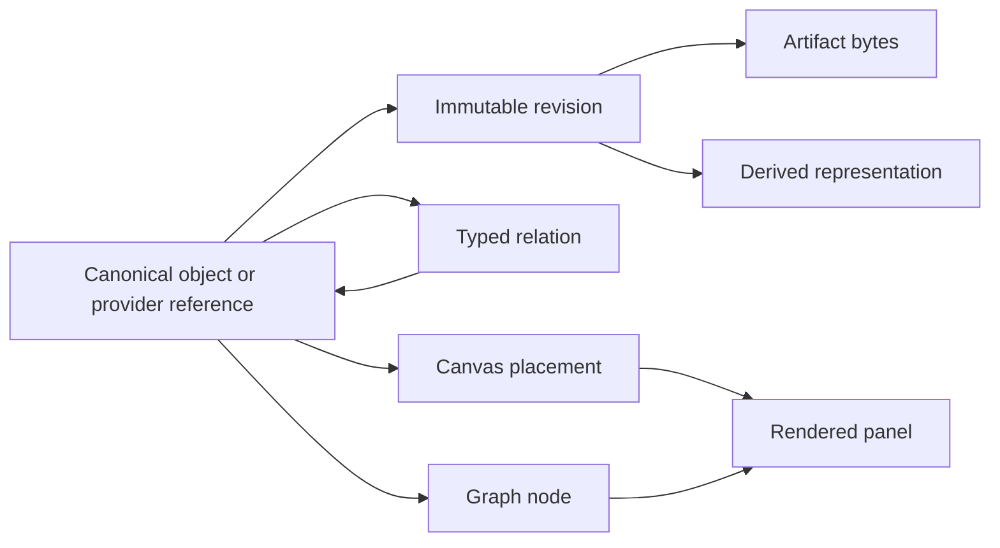

# Galaxy Brain v2: Living Research Atlas

## Product requirements and atomic implementation roadmap

**Status:** Product requirements and roadmap (public copy)

**Date:** 2026-09-29

This public copy omits the private implementation ledger. Where the text still mentions a pull request number such as `#140`, it refers to the private development repository and will not resolve here. Roadmap entries in section 8 are capability slices, not pull request numbers.

**Purpose:** Finish the UI and architecture overhaul without preserving the legacy component sprawl.

---

## 1. Executive decision

Galaxy Brain becomes a canvas-first, versioned research atlas over canonical objects.

The foundational primitive is a durable **object reference**, not a React component, graph node, card, or panel. The same object may be projected as a graph node, placed on a canvas, rendered as a paper reader, exported as Markdown, or composed into a Generous surface. A panel is only a view of an object at a particular place and scale.



The product should feel like one calm infinite surface with progressive disclosure, not a dashboard that opens many competing component systems. Canvas, graph, record, PDF, Markdown, ELN, proof, task, and Generous views are projections over shared identity and revision history.

### The short product thesis

- **Galaxy owns durable research objects, artifacts, revisions, placements, assertions, and the immutable proof DAG.**
- **HAM owns memory retrieval and live task/run coordination.**
- **Hyades owns execution and returns verification receipts.**
- **Rosetta owns accepted formal knowledge and correspondence.**
- **Prove2Me interoperates through import/export and remote identifiers; Galaxy must retain the graph if Prove2Me is unavailable.**
- **Generous supplies bounded generative presentation through `gb.surface.v1`; it does not become Galaxy’s object store or shell.**
- **Plugins add features. Connectors are optional configured instances used only by plugins that need an external service.**
- **Nostr is the shared external identity seam. No additional Galaxy identity product is required.**

---

## 2. Desired product experience

### Default entry

Opening a project or workspace lands on a full-viewport infinite canvas, not a dark-blue field card, dashboard, list, or receipt-like record. The global top rail remains small and stable. Contextual tools appear near the selection and may be pinned.

The user can:

1. Drop or import any supported media.
2. See a titled object placed on the canvas immediately.
3. Zoom from corpus/project density to cards, documents, passages, equations, and exact anchored regions.
4. Switch lenses without changing the underlying object:
   - **Atlas:** spatial arrangement and mixed media.
   - **Graph:** structure, dependencies, branches, conversation trees, proof DAGs.
   - **Read:** PDF, HTML, Markdown, media, or code detail.
   - **Verify:** evidence, challenge, provenance, receipts, contradictions.
   - **Compose:** branch, compare, synthesize, group, and publish.
5. Select text, a figure, an equation, a page region, an audio interval, or a code range and turn it into an anchored note, relation, task, or agent request.
6. Ask an agent to operate on the selected bounded context without granting it authority over unrelated data.

### Semantic zoom

Zoom is semantic, not merely optical:

| Scale | Primary representation |
| --- | --- |
| Corpus | density, constellations, project regions, health/frontier summaries |
| Project/campaign | clusters, milestones, task/proof regions, time bands |
| Task/run/chat | branch trees, dependencies, artifacts, claim/run state |
| Object | paper, experiment, task, theorem, note, media, surface |
| Region/atomic | excerpt, equation, figure, source line, metric, anchored claim |

The renderer must aggregate and substitute representations at scale. It must not mount one DOM panel per atomic object.

### Visual language and preserved reference fixtures

Two existing prototypes are explicit design inputs, not disposable demos:

- `snapshots/2026-09-10-later-previews/task-constructor-preview.html` is the interaction reference for focused task construction: a legible goal/context area, atomic jobs, dependencies, configuration/inspection, version-aware save, preview, and dispatch. Rebuild it through the task plugin and shared object/graph seams rather than restoring the Flowise modal or copying the archived HTML.
- `galaxy-brain-semantic-zoom.html` is the interaction reference for multi-scale navigation: aperture/lens controls, constellation-to-object transitions, progressive labeling, contextual inspection, and the sense that graph structure becomes navigable terrain. Preserve that spatial behavior, not its old dark-navy palette.

The default visual system uses the new living-scholarly-field theme across Canvas, Graph, Task Constructor, ELN, Papers, and inspectors:

- research paper `#F9F6F1` for primary surfaces;
- field sage `#6D7A68` and forest ink `#1E2A24` for structure and verified/core state;
- ochre `#C79A4B` for attention/frontier state;
- terracotta `#B66238` for conflict, rejection, or challenge;
- dusty indigo `#4E5A8C` for agent/task activity and secondary semantic paths;
- archive tan `#D8C8A6` for muted regions and provenance surfaces;
- Alegreya/Alegreya Sans for scholarly hierarchy and interface text, with JetBrains Mono for code, identifiers, receipts, and provenance.

Colors are semantic tokens with contrast-tested light and optional dark mappings; plugins consume the tokens and may not ship isolated product palettes. Paper texture and botanical/cartographic ornament remain subtle framing, never content-obscuring decoration.

---

## 3. Explicit non-goals and removals

Galaxy Brain will not preserve legacy UI merely because it exists.

### Remove from the product shell

- Global chat panel and chat overlay.
- Global tool panel.
- Social dashboard, feeds, accounts, and social connector work.
- Flowise-derived workflow editor as a general-purpose modal.
- Duplicate hand-built production pan/zoom implementations after Atlas parity.
- Browser-configurable provider URLs, arbitrary proxies, and browser-stored provider secrets.
- A second Galaxy role/identity hierarchy layered over Nostr.

Conversations remain useful, but become versioned objects rendered as a tree/branch graph or opened in context. Workflows remain useful, but become task plans or plugin-contributed constructors rather than preserving the Flowise product surface.

### Keep and consolidate

- PDF and paper reader.
- Markdown with KaTeX and source-safe HTML handling.
- ELN records and evidence drawer.
- Task constructor and proof campaign graph.
- Existing lightweight code editor; do not add Jupyter until a kernel-backed scientific workflow actually requires it.
- Voice input and captured audio artifacts.
- `gb.surface.v1` and the safe Generous renderer.
- Version histories, canonical references, artifacts, provenance, and Markdown export.

---

## 4. Current implementation state

v2 is delivered as a stack of small, independently reviewed changes in the
development repository. The per-change ledger is not reproduced here.

### In place

- Immutable canvas revisions with tenant-scoped placement persistence.
- A canonical HAM memory workspace with supersession lineage, relations, and
  object-reference resolution.
- A Nostr-backed `/connect` flow for connecting other applications, such as
  Generous, to a workspace.
- A paper reader organized around the document, the proof DAG and proof-work
  overlay, the ELN, the task constructor, the surface store, the object-link
  ledger, Markdown/KaTeX rendering, durable document ingestion, and the
  plugin proxy.
- `/workspace` renders the Atlas directly.

### Open or incomplete

- Durable presentation-only Atlas frames exist; groups, corpus and code
  aggregation, Rosetta publication interoperability, broader agent mutations,
  collaborative change streams, and video remain incomplete.
- Saved task plans can be dispatched to Hyades through a server-only adapter;
  deployed end-to-end validation remains incomplete, and saving or proposing a
  plan alone never executes it.
- Local document chunks support bounded lexical retrieval. Chunks are not
  embeddings, HAM memories, or canonical graph objects.
- Multiple canvas implementations remain in the tree. Legacy `GalaxyCanvas`,
  the Flowise portability/editor closure, and duplicate settings are retired
  only after each replacement is verified in deployment.

### Production boundary

Repository state, merged state, CI state, and deployed state are distinct. Before relying on any landed route, verify the production SHA, migrations, configuration, and health. Hosted checks that execute zero steps because of billing limits are inconclusive.

---

## 5. Canonical model

Galaxy should not introduce one giant polymorphic table containing every provider’s data. It should use a small canonical reference/projection seam over domain-owned stores.

### 5.1 Object projection

Introduce `gb.object-projection.v1` as the common read envelope used by canvas, graph, search, plugins, and agents:

```ts
type GalaxyObjectProjection = {
  schemaId: "gb.object-projection.v1"
  ref: string                   // canonical gb.object-ref.v1
  kind: string
  revision: {
    policy: "latest" | "pinned"
    id: string | null
    contentHash: string | null
  }
  title: string
  summary?: string
  mediaType?: string
  representations: RepresentationRef[]
  provenance: ProvenanceSummary
  capabilities: string[]       // open, annotate, place, branch, etc.; never authority
}
```

This is a projection contract, not a new source of truth. Each resolver remains responsible for authorization and revision resolution.

### 5.2 Artifact and representation

Use four distinct concepts:

1. **Resource/object:** durable conceptual identity, such as a paper or experiment.
2. **Revision:** immutable state of that object.
3. **Artifact:** exact captured bytes, content-addressed by SHA-256.
4. **Representation:** a derived whole-object form such as PDF, HTML, Markdown, extracted text, thumbnail, audio waveform, or normalized structured output produced by Docling.

```ts
type Artifact = {
  id: string
  sha256: string
  byteSize: number
  mediaType: string
  originalFilename?: string
  displayFilename: string
  storageRef: string
}

type Representation = {
  id: string
  objectRevisionRef: string
  sourceArtifactRef: string
  kind: "original" | "pdf" | "html" | "markdown" | "text" | "thumbnail" | "structure"
  contentHash: string
  transformReceipt?: string
}
```

Paper filenames should be derived from normalized paper title plus stable disambiguator, while preserving the original source filename in provenance.

### 5.3 Anchors and chunks

Chunks are derived indexing units, not mutable canonical objects. A chunk’s identity is deterministic from its representation plus selector and chunker version.

Anchors are durable addressable coordinates into a representation:

```ts
type Anchor = {
  schemaId: "gb.anchor.v1"
  id: `sha256:${string}`
  representationId: string
  representationSha256: string
  selector:
    | { kind: "page-region"; page: number; coordinateSpace: "normalized-page"; polygon: number[]; quoteHash?: string } // exact page-aware document-structure representation
    | { kind: "text-quote"; exact: string; prefix?: string; suffix?: string; page?: number }
    | { kind: "json-pointer"; pointer: string }
  selectorSha256: string
  anchorSha256: string
}
```

The first implementation deliberately limits anchors to exact document
representations. Time ranges and code ranges will use the same content-addressed
pattern in their owning plugins once those representation contracts exist.
Normalized page coordinates are snapped to a one-million-unit grid before
canonical hashing, avoiding runtime-specific exponent and floating-point text.

Relations may target an object or an anchor. A highlighted equation therefore remains connected to its exact paper revision and region without pretending the highlight is a duplicate paper node.

### 5.4 Graph and surface separation

```text
Object reference    durable identity
Graph node          object participating in one graph projection
Canvas placement    spatial occurrence of an object
Panel               renderer output for a placement at one zoom level
Surface             saved/versioned Generous composition; itself an object
```

One object may have multiple placements. One saved Generous surface is normally one placement; its internal component tree is not automatically exploded into independent canvas nodes.

### 5.5 Relation trust classes

Every graph/canvas edge carries one of four non-interchangeable classes:

- `structure`: deterministic provider structure such as `contains` or `defined_in`.
- `assertion`: authored, retractable semantic relation.
- `verification`: evidence backed by an accepted verification receipt.
- `candidate`: provisional retrieval/similarity relation, normally `near`.

Style, export, agent context, and inspection must preserve the class. Proximity or an upstream label cannot upgrade evidence.

---

## 6. Plugin model

### 6.1 Definition

A plugin is a versioned feature bundle. It may contribute any bounded combination of:

- commands;
- sources;
- transforms;
- projectors;
- surface/component renderers;
- agent tools;
- server routes;
- optional connection types.

A connector is only a configured instance required by a plugin, such as a GitHub repository, Prove2Me endpoint, watched folder, or remote document store.

### 6.2 Manifest

Replace the current product-category manifest with `galaxy-plugin.v1`:

```json
{
  "schemaId": "galaxy-plugin.v1",
  "id": "paper-research",
  "version": "1.0.0",
  "contributes": {
    "commands": ["paper.import", "paper.clip", "paper.enhance"],
    "sources": ["file", "url", "arxiv"],
    "transforms": ["pdf.text", "pdf.structure"],
    "projectors": ["paper.card", "paper.reader", "paper.atomic"],
    "agentTools": ["paper.open", "paper.anchor.create"],
    "ingestionPlans": ["paper.upload-default"]
  },
  "connections": []
}
```

### 6.3 Runtime rules

- Registry remains code-owned and allowlisted for v1; manifests cannot register arbitrary executable browser code.
- Plugin routes select server-owned destinations. No arbitrary proxy URL or authorization header is accepted from the browser.
- Plugin configuration and external credentials stay server-side.
- Ingestion-plan manifests contribute only stable IDs. Exact definitions,
  ordering, adapter policy, and canonical hashes remain code-owned and are
  independently resolved at the server boundary.
- Plugins exchange canonical references and validated envelopes, not internal database rows or React props.
- A plugin may add a projector without owning the canonical object.
- Missing plugins degrade to an unknown-object card with provenance and deep link; they do not make the workspace unreadable.

### 6.4 Initial built-ins

- Core canvas and object projection.
- Paper/PDF/Markdown research.
- ELN.
- Task and proof coordination.
- HAM memory/search.
- MarkItDown/Docling transform adapters.
- Generous bounded surfaces.
- Prove2Me import/export.
- Code viewer/editor.
- Voice capture/transcription.

---

## 7. Functional requirements

### 7.1 Canvas-first shell

- `/workspace` opens the default Atlas canvas.
- Canvas fills the viewport below the top rail.
- The Field becomes a lens/projection, not a competing home screen.
- Contextual HUD follows selection and supports pinning.
- Keyboard command palette exposes the same actions as pointer UI.
- Lens rail remains stable across Atlas, Field, Graph, Papers, Tasks, ELN, and Surfaces.
- One workspace/project has one default canvas and may have multiple named canvases.
- Camera, hover, selection, and active tool remain local; placements and presentation edges are versioned.
- Accessible list/search/detail alternatives remain available.

### 7.2 Projectors and progressive disclosure

Initial projector types:

- paper;
- note/Markdown;
- generic document;
- image;
- audio;
- video;
- code;
- ELN experiment/hypothesis;
- task/run/chat tree;
- proof graph/node;
- HAM memory;
- Generous surface;
- unknown reference fallback.

Each projector supplies far, medium, near, and detail representations. Rich DOM views mount only near the viewport and above declared zoom thresholds. During motion, expensive nodes use placeholders.

### 7.3 Ingestion

- Accept file drop, paste, URL capture, arXiv identifier, browser clipper capture, and plugin sources.
- Persist original bytes before transformation.
- Deduplicate exact bytes by content hash without collapsing distinct provenance.
- Emit immutable transform receipts including plugin/version/config/input/output hashes.
- Preserve PDF, HTML, Markdown, extracted text, and structured representations separately.
- Run Docling for structure-rich PDF/DOCX/HTML ingestion when supported, preserving reading order, page provenance, headings, tables, figures, formulas, and bounding regions.
- Normalize Docling output into a versioned Galaxy document-structure envelope; do not make Docling's library-specific object model the canonical database schema.
- Use MarkItDown as the lightweight Markdown/text path and as a bounded fallback when Docling is unavailable or fails. A failed derivative never invalidates the stored original.
- Generate deterministic anchors/chunks after the representation exists.
- Name downloaded PDFs from paper metadata and retain original filename/source URL.
- Auto-tagging proposes tags with provenance and confidence; it never silently overwrites authored tags.
- Repeated idempotent import cannot create duplicate resource revisions or placements.
- Failed transforms retain the original artifact and expose retry/reprocess.
- A named ingestion plan is immutable intent and provenance, not a general
  workflow DSL: it cannot carry endpoints, credentials, code, callbacks, or
  Atlas placement. Its canonical snapshot is bound to the durable import;
  actual transform receipts remain execution truth.

**Implemented Atlas file boundary:** the live Atlas accepts exactly one local
PDF, static PNG/JPEG/WebP/GIF, strictly profiled WebM/Opus audio, or allowlisted
UTF-8 Markdown, text, code, JSON, XML, CSV, YAML, or TOML file through the
registered `document.upload` source by drag/drop or the keyboard-accessible
import dialog. Raster images and WebM/Opus audio are
capped at 20 MiB; other accepted documents retain the 100 MB ceiling. Windows
files with an empty media type use a closed extension-to-media mapping while
their bytes remain unchanged. Atlas imports the canonical durable document
before placing its pinned revision at the bounded world-space drop point.
Confirmed imports retain their reference, operation identity, and point for a
placement-only retry; repeating the same file on the same canvas reconciles and
focuses the existing card. Audio admission parses the complete bounded EBML
tree, requires an audio-only WebM with one Opus track and playable unlaced
blocks, and binds exact container metadata to the stored byte hash. Unsupported
audio/video containers, URL, directory, multi-file, and mixed drops fail before
any write. Accepted originals never fall back to browser data URLs or local
asset storage.

### 7.4 Paper and document reading

- Render PDFs with selectable text and accurate page coordinates.
- Render HTML and Markdown with shared KaTeX behavior.
- Support pen/highlight, text selection, box selection, and margin notes.
- `Clip` creates an anchored excerpt/reference.
- `Task` creates a task whose input contains the pinned object and anchor reference.
- `Enhance` opens a bounded action menu: explain, find related mechanisms, challenge, compare, search corpus, or start a branch.
- Figures/equations may be peeled into anchored cards while retaining source lineage.
- License metadata controls automated remote fetching/serving policy, not a user’s ability to upload and privately read their own lawful copy.

### 7.5 Graph and semantic field

Define `gb.graph-projection.v1`:

```text
graph(root, lens, scale, viewport, filters, valid_at, known_at, cursor)
  -> nodes, edges, aggregates, provenance, continuation
```

- The same engine supports project/task/run/chat trees, proof DAGs, citation networks, HAM neighborhoods, and mixed federated views.
- Layout occurs in a worker, uses persisted/cached positions when available, and has a bounded fallback. No large force simulation runs synchronously during React render.
- IDs are opaque/collision-safe and identity stays in node data.
- Clicking a node opens a contextual inspector or navigates to its canonical view.
- Zooming out from one proof campaign reveals other missions/projects and then the corpus field.
- Branch/fork/join lineage is durable and remains visible after synthesis.
- Search progressively combines local Galaxy hits and authorized HAM hits without implying a single relevance score when scores are incomparable.

### 7.6 Tasks, workflow construction, and branching

- Opening a task uses the Task Constructor reference interaction as the task's near/detail projector, either embedded on the canvas or expanded into a focused workbench without changing object identity.
- A task owns a goal, bounded context references, atomic jobs, typed dependencies, branch/join structure, approvals, executor binding, and versioned outputs.
- Jobs are task-local graph objects; dependencies and branch/join edges appear in the same graph projection used by agents to discover available work.
- `Challenge`, `Compare`, and `Synthesize` create explicit review/branch/join jobs with pinned inputs rather than hidden chat prompts.
- Saving creates a new immutable task-plan revision. Dispatch is a separate authorized action and returns a Hyades/HAM receipt; a saved plan is not a started run.
- The constructor uses the shared theme, typography, command system, Markdown/KaTeX renderer, and provenance inspector.
- Task trees semantically zoom from project/campaign summaries to task cards, job DAGs, run attempts, outputs, and exact referenced regions.
- The bounded Graph/Field reader treats a saved plan revision and each of its
  jobs as hash-pinned canonical references. It loads only current revisions
  available from the task-plan authority; a stale historical hash fails closed
  until a hash-indexed revision reader exists. Whole plans are admitted or
  omitted together, selected plan/job references receive priority, and source
  truncation remains explicit.

### 7.7 Proof campaigns

Canonical split:

```text
galaxy.proof-dag.v1          immutable structure
galaxy.proof-verification-set.v1 immutable receipt-backed baseline
galaxy.proof-work-state.v1   mutable claims/runs/proof status
Hyades receipt               execution and verification evidence
Rosetta graph                accepted durable formal knowledge
Prove2Me adapter             interoperable import/export and remote IDs
```

- Existing repository-field graphs remain browseable and non-claimable.
- A mission explicitly selects one main theorem and prerequisite closure.
- Activation is an atomic server-authoritative operation over exact source,
  intent, reviewed mission digest, verification baseline, and idempotency key;
  the browser cannot submit a DAG, frontier, or work-state seed.
- Curated milestones and theorem dependencies remain distinct.
- Derived frontier nodes become claimable only for an active mission.
- `work.status` remains separate from `proof.status`.
- Verification accepts only when `candidate_sha256 === receipt.solution_sha256` and the receipt meets the declared verifier/toolchain/sorry-free policy.
- Receipt envelopes are evidence containers, not verifiers. A versioned server adapter must authenticate or replay exact receipt bytes before a non-empty baseline can mark any inherited node verified; an explicit empty baseline marks none.
- Live accepted verification uses a dedicated exact-byte endpoint and immutable
  evidence ledger; the generic work-transition route cannot establish or reject
  proof truth, and its Nostr requester is never treated as verifier authority.
- The only enabled authenticated adapter is `proofs-blah-dev@1`, for signed
  proofs.blah.dev reports. Its ledger writes run only under the separate
  `gb_proof_verifier` database authority. Hyades receipts still fail with no
  write. Historical unledgered `verified` state is blocked and cannot release
  dependents; explicit supersession is the recovery path.
- The first live activation path deliberately accepts only that empty baseline.
  Non-empty `proofs-blah-dev` baselines can be registered as evidence, but
  activation does not yet inherit them.
- HAM task completion never means Lean verification.
- Prove2Me, Hyades, or HAM outages do not erase the Galaxy-owned DAG.
- Rosetta promotion is explicit and records the accepted verification/correspondence evidence.

### 7.8 ELN

- Experiment, hypothesis, metric, protocol, sample, attachment, and observation retain canonical versioned identity.
- Record, Canvas, Graph, and Markdown are projections of the same record.
- Durable attachments import original bytes through the document ingestion spine, then bind an immutable canonical pinned document revision to the tenant-owned experiment. A confirmed import is never repeated merely because the binding retry failed.
- Historical `linked_papers` values remain a separate read-only legacy reference list; they are not rewritten or backfilled as durable attachments.
- Metrics append exactly once and retain immutable evidence/provenance.
- Draft validation errors never cause a mixed saved/live projection.
- Autosave generation tracking reports **Saved** only when the current draft has been acknowledged.
- ELN objects can be placed on canvases, linked to paper anchors, and included in task/proof context.

### 7.9 Code and voice

- Keep one lightweight code editor/projector for v1.
- Execution is a separately authorized plugin action and returns artifacts/receipts; the editor itself does not imply an execution environment.
- Add Jupyter only after a concrete kernel-backed scientific workflow is specified.
- Voice input is available from the contextual HUD and command palette.
- Audio may be retained as an artifact when the user chooses; transcript is a representation with provider/version provenance.
- Browser speech recognition is an optional local adapter, not the only transcription path.

**Implemented durable-audio boundary:** a local `.webm`/`audio/webm` Opus
recording may use the existing `gb.document.import.v1` artifact, document,
revision, and original-representation spine. The proxy and backend independently
validate the bounded audio-only container; detail and Atlas projections expose
only its digest-bound manifest. The authenticated reader verifies exact response
identity, media type, length, ETag, and SHA-256 before creating a revocable Blob
URL, presents native controls without autoplay, and revokes on failure, abort,
replacement, or unmount.

**Implemented review-first recording slice:** `voice.capture.open` may request
microphone access only after the user presses **Record audio original** and only
when the browser advertises `audio/webm;codecs=opus`. The resulting bounded
bytes pass the same strict audio-original validator, remain staged as one
tenant/principal/workspace/canvas-scoped IndexedDB recovery record, and are
reviewable beside the editable transcript before any durable write. Confirming
the review runs one checkpointed saga: exact audio import, exact Markdown
transcript import, an authored `derived_from` object link from both pinned
revisions, then transcript-only canvas placement. Retries preserve the exact
bytes, text, metadata, references, and idempotency identities; partial success
is reported rather than silently downgraded. Typed/transcript-only capture stays
available. Installed Chrome and Edge `MediaRecorder` output is covered by exact
fixtures, including bounded unknown-size Cluster framing. Capture staging stays
non-idle until validation and IndexedDB acknowledgement complete; stale capture
generations and capture-bound deletion cannot replace or remove newer audio.
Unknown-size Cluster delimiting consumes the same bounded element budget as
ordinary validation. Recovery cleanup and fallback migration are atomic,
capture-bound IndexedDB transactions, while a late capture cannot overwrite a
different capture that already holds durable checkpoints. A capture whose
local staging write fails continues the explicit save saga with in-memory
checkpoints instead of calling a missing IndexedDB record. If
recovery storage is unavailable, closing requires an explicit accessible choice
to keep the dialog open or discard the in-memory audio, and abandonment copy
names the exact durable audio, transcript, link, and placement checkpoint state.
The voice plugin still exposes no agent tools. Backend ASR,
agent/MCP microphone access, waveforms, MP3/WAV/video, remote audio ingestion,
transcoding, separate audio placement, and execute/publish authority remain out
of scope.

### 7.10 Generous

- Galaxy’s merged `/connect` flow is the identity/consent path. Do not require HAM binding or manual agent-key issuance for the human connection flow.
- Deploy and verify the merged Generous PR #41 connection UI against the deployed Galaxy route.
- Generated A2UI saves as a draft and requires explicit promotion.
- Promoted `gb.surface.v1` records are canonical surface objects and may be placed on canvases.
- Galaxy stores the schema/catalog/renderer versions and content hash.
- Unknown or incompatible surface versions fail visibly and retain the last valid presentation.
- The Generous component tree remains internal layout inside the surface placement.

### 7.11 Agent/MCP control plane

Expose bounded tools, not raw component manipulation:

- `objects.search`, `objects.get`, `objects.representations`;
- `canvas.get`, `canvas.place`, `canvas.move`, `canvas.group`, `canvas.remove`;
- `relations.propose`;
- `anchors.create`;
- `tasks.create`, `tasks.branch`, `tasks.compare`, `tasks.challenge`, `tasks.synthesize`;
- `proof.graph.get`, `proof.frontier.get`, `proof.claim` through the correct coordinator;
- `surfaces.createDraft`, `surfaces.promote` with explicit confirmation.

Agent/MCP relation authority ends at a pinned, pending proposal. Only an
authenticated human browser session may accept or reject it, and only that
human path may create or retract an active authored relation. Acceptance
reauthorizes both exact endpoints and binds the append-only decision to an
authored active link in one transaction, creating one if absent; rejection
creates no link. Candidate, accepted,
and authored relation semantics never imply proof or verification.

Every mutation is Nostr-attributed, version-fenced, idempotent, and audited. Canvas authority never implies canonical-content, semantic-assertion, execution, promotion, or cross-tenant authority.

### 7.11 Sharing and collaboration

- Share an object, pinned revision, canvas snapshot, or canvas-plus-chat explicitly.
- Share links reveal only the selected scope and resolve pinned references reproducibly.
- First collaboration milestone is versioned changes plus invalidation/reload, not a CRDT rewrite.
- Live cursors/presence are ephemeral and optional.
- Branch/fork/join is durable object lineage, not just live presence.
- Agent goals/task plans may be attached to commits or artifacts; raw private logs are not required.

**Implemented boundary:** Atlas offers explicit registered commands for
object-only and saved-canvas-only immutable v1 bundles, plus one closed v2
canvas-plus-conversation scope. The combined scope binds the exact locally
reviewed canvas version/hash and one exact pinned chat; the server reconstructs
at most 1,000 historical turns and their branch edges. Its payload is explicitly
a redacted transcript projection: user/assistant text is published with its own
content hash, while system/tool bodies are replaced by typed redaction records
that retain source identity without copying private instructions or outputs.
Artifact references, provenance, runs, logs, presence, credentials, live state,
future turns, and future canvas changes are excluded. The browser sends only
exact selectors, both Canvas and accessible
List require confirmation, links remain authenticated in the originating
tenant, and ambiguous creation retries reuse one idempotency key. This is not a
public-link feature, chat permission inheritance, or implicit transcript share.

---

## 8. Atomic PR roadmap

Each PR should be independently reviewable, migration-safe, and testable. A child PR must not hide conflicts against current `main`.

Roadmap PR numbers below describe capability slices; they are not GitHub pull
request numbers. Section 4 summarizes what is in place and what remains open.

### PR 0 — Architecture truth and deletion ledger

**Purpose:** Align documentation before more implementation lands.

**Changes**

- Replace stale Prove2Me ownership statements with Galaxy-owned durable DAG plus Prove2Me interop.
- Rewrite `PLUGIN_ARCHITECTURE.md` around feature bundles and optional connections.
- Add the object/node/placement/panel vocabulary and canonical ingestion model.
- Record the deliberate removal list for chat panel, tool panel, social, Flowise, and duplicate canvases.
- Mark `MASTERPLAN.md` and `ELN.md` sections that are superseded rather than trying to implement every historical item.

**Exit gate:** no canonical document contradicts the architecture in this PRD.

### PR 1 — Finish and deploy the Generous connection

**Purpose:** Complete the nearly finished cross-application loop.

**Changes**

- Verify/deploy Galaxy main containing #135/#137.
- Recheck merged Generous PR #41 at `75864141…` against the exact deployed Galaxy connection routes.
- Merge only after callback origin, one-time exchange, disconnect, and surface deep links pass.
- Remove documentation that instructs users to create legacy `gbk_` tokens or bind HAM merely to connect Generous.

**Exit gate:** from Generous, a Nostr-authenticated Galaxy user can connect, save a draft, browse revisions, promote, disconnect, and open the surface in Galaxy without exposing an `nsec`.

### PR 2 — Canvas persistence corrections

**Purpose:** Repair the schema before more features depend on it.

**Changes**

- Replace the single-canvas constraint with one default canvas plus named canvases.
- Preserve durable actor attribution without a foreign key that prevents membership removal.
- Add canvas slug/title/default policy and migration of current workspace canvases.
- Retain immutable revisions, expected version/hash, and RLS behavior.

**Exit gate:** a workspace can own multiple canvases; removing access does not erase or block historical authorship; old canvases round-trip unchanged.

### PR 3 — Reconcile the useful Field work from draft #138

**Purpose:** Complete the unified shell without making Field the default home.

**Changes**

- Rebuild against the strict authorized Graph projection rather than reviving
  the legacy workspace container.
- Full-screen Field under the shared rail.
- Live-HAM search verification and bounded long-result behavior.
- Clearly separate Galaxy and HAM scores until a calibrated fusion exists.
- Finish ELN rail parity and responsive/accessibility checks.

**Exit gate:** Field is a first-class lens; failures identify their source; canvas remains the default entry.

### PR 4 — Plugin manifest v1 and static host

**Purpose:** Establish the feature-extension seam.

**Changes**

- Add `galaxy-plugin.v1` schema and registry types.
- Add contribution registries for commands, sources, transforms, projectors, agent tools, and optional connections.
- Adapt HAM and MarkItDown without changing behavior.
- Add unknown/missing plugin fallbacks and manifest/version diagnostics.

**Exit gate:** a fixture plugin contributes one command, projector, and transform through typed contracts; no arbitrary endpoint or browser executable can self-register.

### PR 5 — Object projection and projector registry

**Purpose:** Make all views consume the same object seam.

**Changes**

- Add `gb.object-projection.v1` and resolver adapters.
- Add static projectors for paper, Markdown, media, ELN, task, proof, HAM memory, surface, and unknown reference.
- Centralize Markdown/KaTeX behavior.
- Define semantic-zoom representation thresholds and motion placeholders.
- Add global living-field design tokens and require all built-in projectors to consume them.

The implementation now includes the bounded authenticated projection gateway:
the browser submits canonical references, provider-owned stores authorize and
resolve minimal source records server-side, and code-owned adapters assemble
the public `gb.object-projection.v1` envelopes. Local Galaxy reads share one
RLS-bound repeatable-read snapshot; HAM tasks and memories keep their existing
tenant bindings. Missing or denied objects are indistinguishable unavailable
results, while malformed or unavailable providers fail closed. Canvas hydration
remains transient and is deliberately the following slice: durable snapshots
continue to store placement identity and geometry, never titles or canonical
bodies.

**Exit gate:** the same pinned paper reference renders consistently in list, graph inspector, canvas placement, and Markdown citation without copying canonical content.

### PR 6 — Canvas becomes the product shell

**Purpose:** Deliver the visible overhaul.

**Changes**

- Route `/workspace` to the full-screen Atlas canvas.
- Add contextual/pinnable HUD and command palette.
- Support placing any registered projection.
- Restore the Task Constructor reference interaction as the task near/detail projector and focused workbench, using the new shared theme and canonical task/job graph rather than the archived component shell.
- Carry the semantic-zoom prototype's constellation-to-region-to-object-to-atomic progression into Canvas, Graph, Tasks, and Papers.
- Move chat/tool/social/Flowise entry points out of the shell.
- Keep old components unreachable behind a temporary rollback flag until parity tests pass.

The first command-deck slice registers `task.plan.open` through the static
plugin registry and maps it through a code-owned dispatcher. Pointer and
keyboard entry points share that dispatcher, which accepts only the selected
canonical `ham.task` reference and binds pinned `version:N` identity back to
the authorized task snapshot before opening one Task Constructor dialog.
Plugin manifests cannot supply modules, URLs, React components, callbacks, or
command payloads. Connector/proxy metadata remains in a server-only module.

**Exit gate:** a user can navigate, search, place, move, resize, group, open, and remove mixed research objects without opening the legacy panels. The Task Constructor supports goal/context editing, atomic jobs, dependency/branch/join editing, versioned save, and separately authorized dispatch. Semantic zoom visibly substitutes representations across at least four declared scales, and both references pass visual-regression checks in the shared living-field theme.

### PR 7 — Durable ingestion spine

**Purpose:** Turn transform previews into durable research objects.

**Changes**

- Add artifact, representation, transform-receipt, anchor, and deterministic chunk contracts/tables.
- Persist original bytes before transform.
- Implement idempotent file/URL/arXiv import.
- Normalize paper titles and display filenames.
- Add a Docling transform contribution for PDF/DOCX/HTML that emits normalized document structure, Markdown, extracted formula text/LaTeX where available, tables, figures, reading order, and page/region provenance.
- Adapt MarkItDown and plain text as lightweight transform contributions and explicit Docling fallbacks.
- Store transform engine/version/config plus input and output hashes in immutable receipts so documents can be reproducibly reprocessed after an engine upgrade.

**Exit gate:** repeated upload of the same PDF preserves provenance without duplicate bytes; the paper opens after reload with original, Markdown, and normalized Docling structure representations and a deterministic title. A fixture containing headings, a table, a figure, and display mathematics retains reading order, page/region anchors, and renderable math. With Docling deliberately unavailable, the original remains usable and the MarkItDown fallback is visibly identified in its transform receipt.

### PR 8 — Transform execution

**Purpose:** Execute the durable ingestion spine through bounded server-owned adapters.

**Changes**

- Add document transform and representation APIs.
- Run Docling, MarkItDown, and plain-text fallback with immutable receipts.
- Fence concurrent attempts with leases and exact input/output hashes.
- Reject redirects and unowned transform destinations.

**Exit gate:** a persisted original can be transformed, retried, and replayed without duplicate receipts or provider work; failures preserve the original and report an explicit fallback/diagnostic.

### PR 9 — Content-addressed document anchors

**Purpose:** Establish the immutable evidence coordinate before building marks and tasks on it.

**Changes**

- Add the cross-runtime `gb.anchor.v1` selector/identity contract.
- Bind page regions, text quotes, and structure pointers to an exact representation UUID and digest.
- Add append-only tenant-scoped anchor persistence and exact revision/representation foreign keys.
- Add document and document-anchor canonical references, local authorization, API routes, and projections.
- Preserve historical loose anchors as explicitly legacy rather than relabeling them canonical.

**Exit gate:** the same valid selector hashes identically in the JavaScript and Python contract implementations. The authenticated API is the semantic trust boundary for canonicalization; PostgreSQL independently enforces bounded structure, immutable representation evidence, canonical-ID shape, uniqueness, tenant isolation, and append-only storage, but does not claim to recompute the cross-runtime float encoding. Repeated creation returns one canonical anchor; links can pin the exact document revision and backing representation. Original-PDF page regions remain deferred until page-count evidence is itself durably bound; PR9 regions target exact page-aware `document-structure` representations.

### PR 10 — Paper regions and task creation

**Purpose:** Complete the “read, mark, act” research loop.

**Changes**

- Page/text coordinate anchors.
- Highlight, pen, box selection, margin note, clip, and enhance actions.
- Create a Galaxy relation or HAM task from an exact pinned anchor.
- Place peeled figure/equation/excerpt cards on the canvas.

**Exit gate:** select or draw around a paper region, create a task, reload, and navigate from the task back to the exact source region.

### PR 11 — Unified graph projection engine

**Purpose:** Make graphs coordination surfaces rather than isolated demos.

**Changes**

- Add `gb.graph-projection.v1` query/result contract.
- Move force layout off the render thread; cache/persist coordinates where appropriate.
- Add scale/lens/viewport bounds and continuation.
- Support proof, task, conversation, citation, and federated modes.
- Add inspector and deep-link navigation.

**Exit gate:** zoom from one campaign/task/chat to its project and corpus context without blocking the browser or losing selection/identity.

### PR 12 — Proof campaign readiness

**Purpose:** Support the upcoming large proof campaign safely.

**Changes**

- Correct durable DAG ownership and Prove2Me adapter semantics.
- Import/export the formal project package and correspondence map.
- Select mission/main theorem and derive prerequisite closure/frontier.
- Project HAM claims/runs and Hyades receipts as overlays.
- Enforce candidate/solution hash binding and passive repository-field non-claimability.
- Expose Rosetta promotion status separately.

**Exit gate:** existing LeanProofs appear as proven/passive structure; a new prototime mission exposes only its valid frontier; claiming, running, verification, and Rosetta promotion remain distinguishable.

### PR 13 — ELN, code, and voice as plugins

**Purpose:** Prove that important capabilities no longer require shell-specific components.

**Changes**

- Register ELN, code editor, and voice capture contributions.
- Make ELN attachments use the ingestion spine.
- Store optional audio and transcripts as artifact/representation pairs.
- Keep execution behind a separate plugin command and receipt.

**Exit gate:** each capability can be invoked from the HUD/command palette and placed on the canvas without importing a global panel.

### PR 14 — Agent/MCP canvas and graph tools

**Purpose:** Turn Galaxy into the intended generative UI control plane.

**Changes**

- Add bounded read tools and versioned canvas commands.
- Add anchor and relation proposals.
- Add branch/compare/challenge/synthesize task proposals.
- Add explicit confirmations for destructive batches, semantic promotion, and surface promotion.

**Exit gate:** an agent can organize selected readable objects and produce a reviewable surface/task branch without receiving broader object, execution, or publication authority.

**Implementation status:** the first slices expose the static bounded read and
pure-proposal catalog, including content-only `objects.search` over exact
document corpus evidence and `graph.window.get` over the existing bounded,
tenant-authorized aggregate corpus window, plus `canvas.arrange`, immutable
`anchors.create`, pending-only
`relations.propose`, and task-plan-specific `task.plan.get` plus pure
`task.plan.propose`. Arrangement reuses the durable canvas transaction and
accepts only non-destructive presentation commands under an exact version/hash,
idempotency key, and fresh NIP-98 signature. Anchor creation is pinned to exact
document representation evidence. Relation proposals remain outside active
object links. Task proposals are exact-base, additive calculations over an
existing saved plan; they neither save a plan nor mutate HAM, canvas, semantic,
execution, or publication state. The Task Constructor producer/review slice and
thin MCP adapter are now present. The constructor invokes the same static
`task.plan.propose` gateway used by MCP, binds requests only from the loaded
saved-plan revision, verifies the returned
candidate before display, and can apply it only to the local browser draft.
Saving that draft remains a separate explicit immutable-revision action.
Browser-session human relation review is now the promotion boundary: agents
remain proposal-only, while an accepted exact pinned proposal binds its
decision to an authored active link, creating one if absent, without upgrading
any proof or verification state.
PR #289 closes only the document-mark authorship boundary: canonical mark
create and update require a matching authenticated human browser session at
the Next gateway and the corresponding trusted marker at the Python API.
Authorized reads and exact pinned mark references remain available, while the
agent, plugin, and MCP catalogs expose no mark-authoring tool. Legacy paper
annotations remain a separate unchanged compatibility surface; this slice does
not claim that they share the canonical mark authority model.

### PR 15 — Sharing, branching, and change notifications

**Purpose:** Make canvases and branches durable collaborative units.

**Changes**

- Named canvas sharing and pinned snapshots.
- Version invalidation/reload stream with authorization recheck.
- Explicit object-only, canvas-only, and canvas-plus-conversation share modes.
- Durable fork/join lineage and optional ephemeral presence.

**Exit gate:** two clients converge through accepted-version plus `409`/reload behavior; a share recipient sees exactly the selected scope.

### PR 16 — Legacy retirement

**Purpose:** Remove the component mess after replacements are proven.

**Changes**

- Delete unreachable chat/tool/social/Flowise code and APIs.
- Delete old `InfiniteCanvas` and `GalaxyCanvas` after migration/rollback window.
- Remove stale settings, routes, tests, dependencies, and historical feature flags.
- Close or rewrite issues that request restoration of deliberately removed legacy behavior.

**Exit gate:** one supported canvas runtime, one plugin registry, one Markdown/math renderer, one graph projection seam, and no legacy shell imports.

---

## 9. Milestones

### Milestone A — Coherent foundation

PRs 0–5 complete.

Outcome: architecture is truthful; Generous connects; canvas schema supports future use; plugins and object projections have stable seams.

### Milestone B — Canvas-first research loop

PRs 6–8 complete.

Outcome: open Galaxy, drop a paper, read it, mark a region, create a task, and return to the source—all through the canvas-first shell.

### Milestone C — Proof campaign control plane

PRs 9–10 complete.

Outcome: navigate proof structure across scales, select an active mission, see the valid frontier, and distinguish work, verification, and publication state.

### Milestone D — Extensible agent workspace

PRs 11–12 complete.

Outcome: voice, code, ELN, and agents operate as bounded plugins and commands rather than global bespoke panels.

### Milestone E — Shareable living atlas

PRs 13–14 complete.

Outcome: named canvases, branch lineage, scoped sharing, collaborative convergence, and deletion of the legacy component system.

---

## 10. Quality and performance requirements

### Correctness

- Every durable mutation is idempotent, version-fenced, tenant-scoped, attributed, and revisioned.
- Pinned references resolve to exact content hashes or fail closed.
- Provider outages do not mutate or silently downgrade canonical data.
- Repeated import, retry, reconnect, and replay cannot duplicate evidence or revisions.
- A relation’s trust class survives every projection/export.

### Performance

- No force/layout computation proportional to a large graph runs synchronously during React render.
- Canvas uses viewport culling, semantic LOD, and a bounded live-DOM overlay count.
- Maintain separate high-density primitive and realistic rich-workspace fixtures.
- Establish release budgets from measured target hardware; initial goals are p95 interaction frames below 33 ms during pan/zoom and no main-thread task above 100 ms caused by layout/projection.
- Local results appear immediately; remote/federated results stream progressively with visible partial/unavailable state.

### Accessibility

- WCAG 2.2 AA target.
- Keyboard-equivalent selection, navigation, and commands.
- Search/list/detail fallbacks for graphical surfaces.
- Visible focus, meaningful labels, reduced-motion support, sufficient contrast, and screen-reader-readable relation summaries.

### Portability

- Markdown export includes a pinned artifact/reference manifest.
- JSON contracts are versioned and schema-validated.
- Canvas layout never becomes the only copy of content.
- Generous, Prove2Me, HAM, and code-provider outages leave local Galaxy data readable.

### Observability

- Record plugin/version, source, transform receipt, latency, retry, and bounded error category.
- Record canvas projection size, visible rich nodes, frame performance, mutation latency, and conflicts.
- Never log credentials, raw private agent logs, or full sensitive document bodies merely for diagnostics.

---

## 11. Test matrix

| Layer | Required evidence |
| --- | --- |
| Schemas | valid/invalid fixtures, bounds, unknown-field policy, deterministic hashes |
| Database | migration, restricted-role startup, RLS isolation, append-only ledgers, rollback plan |
| APIs | authorization, idempotency, replay, stale version/hash, size limits, provider failure |
| Ingestion | exact-byte preservation, dedupe, Docling structure normalization, MarkItDown fallback, transform receipts, formula/table/figure retention, title normalization, anchor stability |
| Canvas | reload round-trip, gestures, multiple placements, named canvases, conflict recovery, semantic representation substitution |
| Graph | cycle/ID bounds, worker fallback, LOD, trust classes, deep links, large valid fixture |
| Task constructor | reference parity, goal/context, job DAG, branch/join, immutable save, dispatch separation, shared-theme visual regression |
| Papers | PDF/HTML/Markdown, KaTeX, page anchors, text anchors, pen/box selection |
| Proofs | passive vs mission, frontier derivation, claims, receipt hash binding, Rosetta separation |
| Plugins | missing plugin, version mismatch, route allowlist, credential non-disclosure |
| Browser | desktop/mobile, keyboard, screen reader smoke, reduced motion, no overlay collisions |
| Production | exact SHA, migrations applied, health, feature configuration, fresh logs, rollback |

---

## 12. Definition of done

The overhaul is complete when all of the following are true:

1. Galaxy opens into a full-screen infinite research canvas.
2. Objects retain one identity across canvas, graph, reader, ELN, task, proof, Generous, and Markdown projections.
3. Any supported media can be imported, titled, placed, reopened, and cited.
4. A paper region can become an anchored card, relation, task, or agent request.
5. Graphs scale from one object/campaign to project and corpus views without blocking the browser.
6. Proof structure, live work, verification, and Rosetta publication are separate and legible.
7. Plugins add capabilities through stable contracts; connections are optional configuration, not the core abstraction.
8. Generous can connect, create a draft, promote it, and place it on the Galaxy canvas.
9. Agents can operate through bounded object/canvas/graph tools without manipulating arbitrary UI or acquiring hidden authority.
10. Global chat, tool, social, Flowise, and duplicate canvas systems are gone from production.
11. List/search/detail and Markdown export keep the corpus usable without the graphical renderer.
12. The deployed application passes migration, tenant-isolation, browser, accessibility, performance, and production smoke gates at an exact SHA.

---

## 13. Recommended next steps

1. Treat landed code as implementation evidence, not deployed-product
   evidence, until the exact landed SHA, migrations, Docling/MarkItDown
   configuration, Atlas entry, graph window, reader, proof registry, ELN
   attachments, voice, Generous connection, and task dispatch have passed
   deployed smoke tests.
2. Verify sharing, accessible List confirmation, redacted transcript rendering
   with Markdown/KaTeX, and tenant isolation in deployment. Keep collaborative
   change streams separate from immutable sharing.
3. Implement the remaining product slices as new atomic changes, preserving the
   same object, plugin, and authority seams.
4. Retire the remaining production-coupled legacy `GalaxyCanvas`, Flowise, and
   duplicate settings/datasource closures only after each deployed replacement
   passes its own rollback-window gate. Deletion remains the last step, not an
   architecture shortcut.

This sequence produces useful visible product progress early while protecting the durable seams needed by later plugins, graphs, agents, and collaboration.
