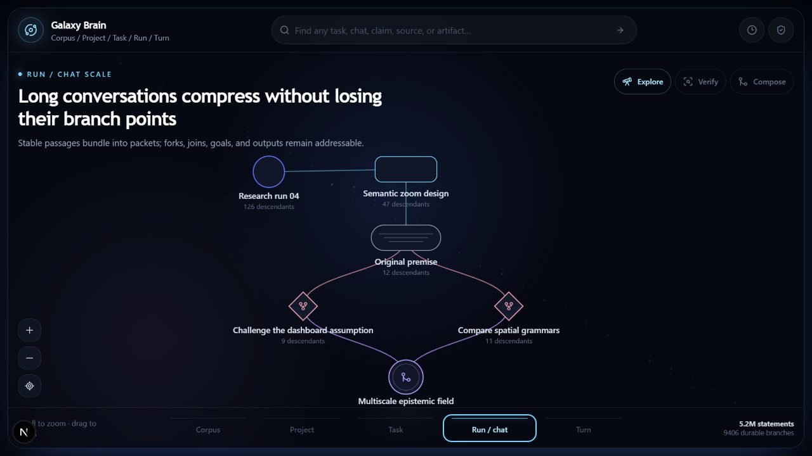

# Galaxy Brain Semantic Field

Status: interaction prototype and architecture proposal
Audience: Galaxy Brain and collaborating projects (Donto, Alpha, Rosetta, HAM)
Action boundary: advisory review only; no merge, deployment, or roadmap commitment is requested



## Outcome

Galaxy Brain should present one canonical, versioned knowledge/work corpus through scale-dependent projections rather than persist separate dashboard, graph, canvas, chat, and record copies. The semantic field is a proposed navigation and action surface over those canonical objects. It is not a new object store.

Semantic zoom changes which object kinds and relations are legible:

1. **Corpus** — projects and global density.
2. **Project** — persistent regions of inquiry.
3. **Task** — bounded work, research, and lineage.
4. **Run / chat** — goals, conversations, bundles, forks, joins, and outcomes.
5. **Turn** — claims, references, artifacts, provenance, access, and time.

The same field supports three lenses:

- **Explore** surfaces containment, continuation, and neighborhood.
- **Verify** emphasizes support, challenge, reference, fork, and join relations.
- **Compose** emphasizes reusable continuations, forks, joins, and supported synthesis.

## Current facts

- `SemanticField` renders the five semantic scales and three lenses as an accessible interactive SVG.
- Selecting an entity exposes `Challenge`, `Compare`, and `Synthesize` branch actions.
- Temporal and permission overlays are present as interaction concepts.
- Workspace nodes can retain a stable `sourceNodeId` and route selection back to the canonical Galaxy Brain node.
- The synthetic standalone preview is available only from a development server
  at `/dev/semantic-field-preview`; production builds return a 404 for it.
- The authenticated `/field` route is the production lens over the same strict
  authorized projection used by Graph. It has no concept fixtures or duplicate
  source loader, and reports bounded or unavailable data without substitution.
- The legacy workspace container has been removed. `/workspace` remains the
  canonical Atlas surface; Field is a separate read-only projection and never
  creates a canvas placement.
- The preview was visually exercised at Corpus, Project, Task, and Run/chat scales. Scale selection, node selection, lens selection, and the accessible status surface worked without browser warnings or errors.

## Prototype boundaries

These are explicit limits, not hidden implementation claims:

- The example hierarchy, aggregate counts, relations, and most timestamps are synthetic fixtures.
- Production Field projects a bounded, focus-first slice of authorized Graph
  objects; the development preview continues to use its small fixture slice.
- Search is a client-side scan of the in-memory projection.
- Draft branch actions are local React state; they are not persisted, versioned, attributed, permission-checked, or executed.
- Verify and Compose currently select relation classes. They do not establish truth, correspondence, proof validity, executable equivalence, or deployment authority.
- Access and time overlays demonstrate the visual grammar but are not yet backed by complete policy receipts or bitemporal queries.
- The current SVG renderer is suitable for a bounded level-of-detail projection, not millions of raw DOM nodes.

## Proposed projection contract

The field should be generated from canonical data by a bounded query resembling:

```text
field(
  root,
  scale,
  lens,
  viewport,
  valid_at,
  known_at,
  actor,
  cursor
) -> {
  entities,
  relations,
  aggregates,
  effective_access,
  continuation_cursor
}
```

Every returned entity should carry:

- stable canonical identity and immutable revision/content identity;
- typed object kind and relation kinds;
- provenance and derivation references;
- event, valid, and known-time coordinates where applicable;
- effective access policy plus the source of inheritance or narrowing;
- evidence status and claim ceiling without collapsing independent evidence coordinates;
- an addressable action surface whose authority is checked outside the renderer.

The server owns aggregation, spatial/semantic indexing, permission filtering, and continuation. The client owns viewport state and rendering. A view may cache projection data but must never become an authoritative private copy of canonical content.

## Action semantics

`Challenge`, `Compare`, and `Synthesize` should create typed canonical branch proposals:

```text
BranchProposal {
  id
  action: challenge | compare | synthesize
  origin_ids[]
  actor_id
  session_id
  base_versions[]
  access_policy
  created_at
  status: draft | admitted | rejected | superseded
}
```

Admission should validate identity, versions, permissions, and required correspondence/evidence receipts. Rendering a button is never authority to perform repository, deployment, credential, or production effects.

## Interoperation questions for collaborating projects

1. **Donto/bitemporality:** Which exact `valid_at` and `known_at` query/result types should the projection contract expose, and how should superseded-but-historically-visible objects be represented without confusing them with active heads?
2. **Rosetta/evidence:** Which independent evidence coordinates and claim ceilings should appear in Verify lens nodes and edges? A proof receipt, correspondence certificate, executable validation, and source provenance should not become one green badge.
3. **Alpha/certificates:** What minimal typed certificate summary can the field display while keeping the compiler/optimizer untrusted and the independent checker authoritative?
4. **Sympnoia/ranking:** Should Explore show semantic candidates while Verify shows admissibility and evidence state, with ranking remaining a separate judgement rather than being implied by spatial closeness?
5. **HAM/coordination:** Which branch-proposal and review events belong in HAM, and which canonical payloads should remain in their owning store with HAM retaining only signed exchange/provenance records?

## Review target

The useful review question is not whether this picture is attractive. It is whether this projection grammar can faithfully expose canonical identity, lineage, bitemporality, access, evidence coordinates, and typed branch actions without turning the visualization into a second source of truth.
